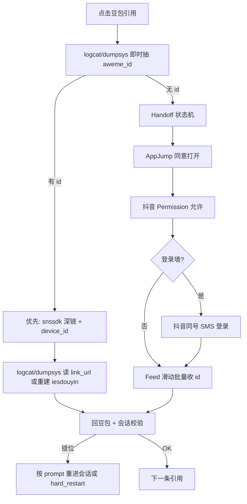

# 豆包→抖音跳转与取链统一方案

## 问题诊断（来自日志与代码）

[`var/雅诗兰黛/spot_check/20260715/spot_check_run.log`](var/雅诗兰黛/spot_check/20260715/spot_check_run.log) 显示三类失败交替出现：

| 现象 | 根因 |
|------|------|
| `AppJumpPromptActivity` + `ids=0` | 只处理了豆包登录，**跳转同意**未稳定点通 |
| `PermissionActivity` 卡住后被 `force-stop` | **抖音运行时授权**未点通；回收逻辑杀抖音回豆包 |
| `ids=1 期望=3` 后 `会话错位→分析区域市场竞品…` | 批量返回 **back×3 + app_start** 落错历史会话，且批量后 **无 `_chat_context_ok`** |

当前实现分散在 [`navigator.py`](app/modules/navigator.py) 与 [`qa_reference_urls.py`](app/modules/qa_reference_urls.py)，**无抖音登录**、无统一 handoff 状态机、无深链优先路径。

---

## 目标架构



---

## 方案分层（按优先级）

### P0 — 深链优先（用户指定，先试）

在 [`qa_reference_urls.py`](app/modules/qa_reference_urls.py) 新增 **`resolve_via_aweme_deeplink`**：

1. 点击引用后 **不等 feed**，先 `stream.mark()` + 短轮询 logcat/dumpsys 抽 `aweme_id`（已有 `_SNSSDK_AWEME_RE` / `extract_aweme_ids_ordered`）。
2. 读取 Android `device_id`：
   - 主：`adb shell settings get secure android_id`
   - 备：logcat 里 intent 自带的 `device_id=` 参数
3. 用 `am start` 打开详情（**先试 `snssdk1128`（日志已验证），再试 `snssdk1180`**）：

```bash
adb shell am start -a android.intent.action.VIEW \
  -d "snssdk1128://aweme/detail/{aweme_id}?device_id={device_id}" \
  com.ss.android.ugc.aweme
```

4. 短等后从 `dumpsys activity top` 读 `link_url=` / 再次 logcat 抽 id → 输出 [`_iesdouyin_url`](app/modules/qa_reference_urls.py)。
5. **不滑 feed、不强杀抖音**（除非 stuck）；`lite_back` 回豆包。

**集成点**：`_resolve_one_citation_url` 与 `try_batch_resolve_douyin` 在现有 `wait_and_accept_app_jump` **之前**先走深链；单条成功则跳过外部 feed 路径。

**探针**：[`scripts/run_douyin_url_probe.py`](scripts/run_douyin_url_probe.py) 增加 **策略 D `deeplink_device_id`**，对比 A/B/C，记录 1128 vs 1180 命中率。

---

### P1 — Handoff 状态机（AppJump + 授权）

新建 [`app/modules/douyin_handoff.py`](app/modules/douyin_handoff.py)（或扩 [`navigator.py`](app/modules/navigator.py)），统一：

| 状态 | 检测 | 动作 |
|------|------|------|
| `AppJump` | `appfilter` / `AppJumpPrompt` | 现有 `wait_and_accept_app_jump` + hierarchy/坐标兜底 |
| `RuntimePermission` | `PermissionActivity` / permissioncontroller | 增强 `_grant_douyin_runtime_permissions`（多页权限循环点允许，vivo 专用 xpath 从 diagnose 补） |
| `LoginWall` | activity 含 Login / 屏上「登录」「手机号」 | 转 P2 |
| `FeedReady` | 非 Permission/Splash | 滑动 + `collect_aweme_ids_after_open` |
| `WebInDoubao` | `WebActivity` in nova | 仅 logcat/dumpsys，不打开抖音 App |

profile 新增（[`gesture_profile.py`](app/config/gesture_profile.py) + [`vivo_v2301a.json`](app/config/profiles/vivo_v2301a.json)）：

- `qa_douyin_handoff_timeout: 20`
- `qa_douyin_deeplink_first: true`
- `qa_douyin_deeplink_schemes: ["snssdk1128", "snssdk1180"]`

[`scripts/adapt_diagnose.py`](scripts/adapt_diagnose.py) 追加规则：`PermissionActivity`、`LoginActivity`、`snssdk` intent 行。

---

### P2 — 抖音同号 SMS 登录（用户确认）

参照 [`sms_login.py`](app/modules/sms_login.py) 新建 **`app/modules/douyin_sms_login.py`**：

- **同 API 同 device_id 池**（`SMS_DEVICE_ID=doubao-crawler-vivo-v2301`），与豆包共用号码资源；`SMS_PLATFORM` 仍用 `doubao` 或 API 侧按 device_id 区分（与现有 `.env` 一致）。
- 触发：`ensure_douyin_logged_in()` 在 **spot_check 批次开始前** 与 **Handoff 检测到 LoginWall** 时各调用一次（带 session 级缓存，避免每条引用重复登录）。
- 流程：打开抖音 → 点「手机号登录」→ 取号 → 输入 → SMS 验证码（复用 `enter_verification_code` 的多方式输入思路，**rid/xpath 需 vivo 真机 diagnose 一次写入**）。
- 成功判据：离开登录页且能进 feed / 深链可打开详情。

**沙箱步骤**：在 [`run_adapt.sh`](var/新设备适配/vivo_v2301a/20260715/run_adapt.sh) 增加 **S05a_douyin_login**，产出 `steps/S05a_douyin_login/` 快照。

**不做**：第一版不 force-stop 抖音清登录态；失败则 report 占用号码 + 换号重试（与豆包一致，最多 3 次）。

---

### P3 — 回豆包与会话修复（解决「杀 app + 错位」）

改造 [`recover_from_external_douyin`](app/modules/navigator.py)：

1. **优先** `press back` 回到豆包任务栈（若 `app_current` 已是 nova Chat，不 force-stop 抖音）。
2. 仅 stuck 时 `force-stop aweme`。
3. 批量/逐条返回后 **强制** `_chat_context_ok(expected_prompt)`（补 [`try_batch_resolve_douyin`](app/modules/qa_reference_urls.py) 缺口）。

新增 [`navigator.reenter_chat_by_prompt(prompt)`](app/modules/navigator.py) 或 [`qa_capture`](app/modules/qa_capture.py) 复用「对话列表 + contains(@text,prompt)」点击目标会话；失败则 `hard_restart_app` + **中止本条**（不再错误 chat 上空转）。

---

## 解析管线新顺序

在 [`resolve_thinking_reference_urls`](app/modules/qa_reference_urls.py) 中调整为：

```
prepare_citations_for_url_resolve
→ [批次前] ensure_douyin_logged_in (一次)
→ 对每条/批量首条抖音引用:
    1. deeplink 路径 (P0)
    2. handoff + feed 批量 (P1)
    3. 逐条 logcat/dumpsys (现有)
    4. 分享复制链接回落 (run_qa_share_link_probe 逻辑，可选 P4)
→ 每条返回后 reenter_chat + _chat_context_ok
```

批量策略调整：若深链/feed 只拿到 **部分 id**，对剩余条目 **逐条深链**（按 citation 点击抽 id），而非仅依赖 feed 滑动。

---

## 测试与验收

| 类型 | 内容 |
|------|------|
| 单元 | `tests/test_douyin_handoff.py`：状态检测、深链 URL 拼装、1128/1180 scheme 列表 |
| 单元 | 扩 [`tests/test_qa_reference_urls.py`](tests/test_qa_reference_urls.py)：深链 intent 文本解析 |
| 真机 | `run_douyin_url_probe.py` 策略 D + 全策略 `overall_ok` |
| 真机 | 雅诗兰黛 1 条：`引用 URL ≥6/12` 且无误入历史会话 |
| 文档 | 更新 [`.cursor/skills/device-adaptation/`](.cursor/skills/device-adaptation/)：S05a 抖音登录、深链优先、handoff 状态图 |

---

## 实施顺序（建议）

1. **P0 深链 + device_id** + 探针策略 D（最快验证用户方案，改动集中在 `qa_reference_urls.py`）
2. **P3 批量后会话校验 + 温和 recover**（立刻减少 0/12 误杀）
3. **P1 Handoff 状态机** + diagnose 规则 + Permission 加强
4. **P2 抖音 SMS 同号登录**（需 S05a 真机 xpath 一轮）
5. 重启雅诗兰黛 worker（`SPOT_CHECK_ALLOW_PARTIAL_DOUYIN_URLS=0`），盯首条 URL 行

---

## 风险与回退

- **snssdk1180 vs 1128**：日志与单测均用 1128；1180 作为第二 scheme 尝试，探针报告分别计数。
- **深链无 aweme_id**：仍依赖豆包点击后 logcat；无 id 时自动降级 handoff，不阻塞。
- **抖音登录 UI 差异大**：SMS 模块 xpath 机型化；失败时明确日志「需 S05a diagnose」。
- **回退开关**：`qa_douyin_deeplink_first: false` 可关闭深链，恢复当前 handoff 路径。
