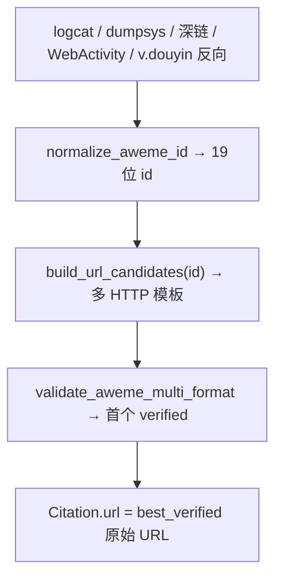

# 抖音 URL 找齐、拼对（多域名格式）

## 根因（用户确认 + manual_verify 日志）

**不是 id 拿不到，是 id 拿到后拼错了。**

| 阶段 | 现状 | 问题 |
|------|------|------|
| 深链 / logcat | `snssdk1128://aweme/detail/{id}` 能出现 | id 已到手 |
| dumpsys | `link_url=https://www.iesdouyin.com/share/video/{id}` 能出现 | 原生格式正确 |
| 拼装层 | 代码多处硬编码 `_iesdouyin_url(id)` 一种模板 | **模板不全、未用 jingxuan/video 等已验证格式** |
| PC 验证 | 只测 iesdouyin 一种 | jingxuan 等格式未纳入验证链 |
| 产出 | 验证失败 → 空串或错误回落 | **有 id 仍写不出可用视频链** |

真机已验证：`7428415093521648905` 对应
- dumpsys：`https://www.iesdouyin.com/share/video/7428415093521648905`
- 浏览器可用：`https://www.douyin.com/jingxuan?modal_id=7428415093521648905`

---

## 目标

1. **找齐**：登记所有已知可映射同一 `aweme_id` 的 HTTP 模板 + 深链模板
2. **拼对**：任意来源抽到 19 位 id 后，**统一经 `build_url_from_aweme_id`** 产出候选 URL
3. **验过再写**：PC 多格式级联验证，**写入第一个 verified 的原始 URL**（best_verified）
4. **真机闭环**：一条完整问答 ≥6/12 抖音引用有 URL

---

## URL 模板全表（待探针逐项确认）

### HTTP（PC 可验证，Citation.url 候选）

| format_id | 模板 | 来源/依据 |
|-----------|------|-----------|
| `iesdouyin_share` | `https://www.iesdouyin.com/share/video/{id}` | dumpsys link_url、历史抽检 |
| `douyin_video` | `https://www.douyin.com/video/{id}` | desktop 302 目标 |
| `douyin_jingxuan_modal` | `https://www.douyin.com/jingxuan?modal_id={id}` | **用户验证可用** |
| `iesdouyin_share_query` | `https://www.iesdouyin.com/share/video/{id}/?region=CN&app=aweme` | v.douyin 展开链 |
| `v_douyin_short` | 仅反向：`v.douyin.com/xxx` → 展开得 id | 不可正向生成 |

### 深链（手机 am start，用于 handoff，非 HTTP 产出）

| format_id | 模板 |
|-----------|------|
| `snssdk1128_detail` | `snssdk1128://aweme/detail/{id}` |
| `snssdk1128_detail_did` | `snssdk1128://aweme/detail/{id}?device_id={did}` |
| `snssdk1180_detail` | `snssdk1180://aweme/detail/{id}?device_id={did}` |
| `snssdk1128_short` | `snssdk1128://detail`（logcat 短形式，**须从 link_url 补 id**） |

**规律**：核心键恒为 **19 位 aweme_id**；HTTP 与深链是同一 id 的不同载体，拼装层必须先 normalize id 再套模板。

---

## 架构（id 中心，非域名中心）



**禁止**：在 `douyin_handoff` / `qa_reference_urls` / `douyin_web_resolve` 各处散落 `f"https://www.iesdouyin.com/share/video/{id}"` 硬编码；统一 import 构建器。

---

## 实现要点

### 1. [`app/modules/douyin_web_resolve.py`](app/modules/douyin_web_resolve.py)

- `AWEME_URL_FORMATS` + `build_url_candidates(aweme_id, device_id)`
- 扩展 `normalize_aweme_id`：
  - `/share/video/{id}`、`/video/{id}`
  - `modal_id=`、`aweme_id=` query
  - `snssdk1128://aweme/detail/{id}` 文本内嵌
- `validate_aweme_multi_format`：按 profile 优先级逐个 HTTP GET/302 验证
- `resolve_verified_url(aweme_id)` → **返回 verified 原始 URL**（非强制 iesdouyin）

### 2. [`app/modules/qa_reference_urls.py`](app/modules/qa_reference_urls.py)

- `_iesdouyin_url` / `_iesdouyin_url_verified` → 合并为 `_douyin_url_from_id(id, profile)` 调用构建器
- `extract_aweme_ids_ordered` / `pick_best_url`：识别 dumpsys 里已有 `jingxuan?modal_id=` 时 **直接保留**，勿重拼错
- `is_likely_douyin_citation`：`douyin.com/video`、`modal_id` 也算抖音 URL

### 3. [`app/modules/douyin_handoff.py`](app/modules/douyin_handoff.py)

- 深链打开后若 HTTP 读不到 link_url，**用 id + 构建器** 拼 URL，不再只调 `_iesdouyin_url`
- PC Web 路径：logcat 有 id → `resolve_verified_url`，跳过开抖音

### 4. 探针 + 文档

- [`scripts/run_douyin_web_resolve_probe.py`](scripts/run_douyin_web_resolve_probe.py)：格式矩阵表，必测 id `7428415093521648905`
- 更新 [`doc/reports/douyin_web_resolve/README.md`](doc/reports/douyin_web_resolve/README.md)

### 5. 真机验收

```bash
.venv/bin/python run_qa_capture.py -s 10ADBY1Z7C0042Z \
  --prompt "雅诗兰黛智妍面霜值得买吗？" --mode fast --resolve-method auto \
  --out-dir var/雅诗兰黛/spot_check/20260715/manual_verify4
```

通过：record.json 抖音类引用 URL ≥6/12，且 URL 经 PC 验证、id 与 logcat 一致。

---

## 与上轮 manual_verify 的关系

- 采集/思考/12 引用：**已成功**
- 失败点：**id 已有（如 7428415093521648905）但拼装+会话漂移导致未写入**
- 本轮优先 **拼对 URL**；会话漂移修复（WebActivity 直出、hard_restart）保留为并行项，不阻塞拼接正确性验证

---

## 产出策略（已确认）

- **Citation.url = 第一个 PC 验证通过的原始 URL**（可能是 jingxuan / douyin.com/video / iesdouyin）
- profile 可选 `qa_douyin_web_url_formats` 调整优先级
- fallback：全部验证失败时写优先级最高模板（标记未验证日志）
