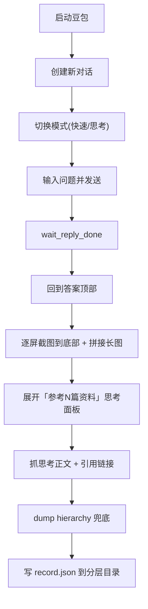

# 豆包问答采集改进（第二轮）

针对真机观察到的 4 个纰漏迭代 [app/modules/qa_capture.py](app/modules/qa_capture.py)、[app/modules/qa_hierarchy.py](app/modules/qa_hierarchy.py)、[run_qa_capture.py](run_qa_capture.py)，不动电商流程。

## 确认的两个决策
- 模式：新增 CLI `--mode`（`fast` 默认 / `think`）。`think` 时确保有思考过程与引用链接。
- 截图：逐屏多张 + 拼接一张完整长图。

## 新流程（issue 2）

## Todo 1 — 真机侦察（关键，先做）
在真机上确认并记录选择器（用截图+hierarchy 分析，最终固化为无模型/无 OCR 的选择器）：
- 「创建新对话」：主页/列表页 `com.larus.nova:id/right_img`（content-desc「创建新对话」）；确认从聊天页需先点 `back_icon`（对话列表）再点。
- 模式切换：输入栏 action 项（`ic_item_img`+`tv_item_name`，content-desc 含「深度思考」）点开后弹出菜单，菜单项 `menu_text`/`menu_sub_text`（快速/思考/专家）。记录精确文案与点击目标。
- 思考引用链接：点击答案里「已完成思考，参考 N 篇资料」节点后，dump 展开后的思考/引用面板，定位引用条目的 rid/text/`content-desc`（链接标题、来源、可能的 URL）。保存样本到 `logs/recon_*`。

## Todo 2 — 目录分层（issue 1）
在 [app/utils/utils.py](app/utils/utils.py) 新增 `build_session_dir(base, script, when=None)`，产出 `<base>/<script>/<YYYY-MM-DD>/<HHMMSS>/`。
- qa_capture 用 `build_session_dir("logs", "qa_capture")`，即 `logs/qa_capture/2026-07-10/111530/`。
- 旧 `logs/qa_<ts>` 命名弃用。

## Todo 3 — 流程改进（issue 2）
在 [app/modules/qa_capture.py](app/modules/qa_capture.py) 新增并串联：
- `_open_new_conversation()`：点「创建新对话」，等待落到干净 ChatActivity。
- `_select_mode(mode)`：打开模式菜单→按 `menu_text` 选「快速」或「思考」；失败则 back 并记录。替换现有易误触的 `_enable_deep_thinking`。
- `run()` 顺序调整为：start_app → login → new conversation → select mode → send → wait → 采集。几何/文案参数进 [app/config/gesture_profile.py](app/config/gesture_profile.py)（`qa_*`）。

## Todo 4 — 完整截图（issue 3）
新增 `_capture_full_screenshots(session_dir)`：
- 先滚到答案顶部，逐屏 `screenshot` 存 `shot_01.png..NN.png`，用 ROI 图像差分判断触底（复用 [app/modules/web_detail_capture.py](app/modules/web_detail_capture.py) 的 `roi_pair_metrics`/`metric_quiet` 思路，聊天区 ROI 用 content 边界）。
- 用 [app/modules/detail_strip_stitch.py](app/modules/detail_strip_stitch.py) 的 `stitch_content_strips_vertical` 拼成 `full.png`。
- `record.screenshots` 存分屏列表，新增 `record.stitched_screenshot`。

## Todo 5 — 思考引用链接（issue 4，最重要）
新增 `_capture_thinking_references(session_dir)`：
- 定位并点击「已完成思考/参考 N 篇资料」节点展开面板；必要时在面板内滚动逐屏 dump。
- 解析引用条目（标题/来源/URL）与思考正文，抓完后关闭面板。
- [app/modules/qa_hierarchy.py](app/modules/qa_hierarchy.py) 增加 `parse_thinking_panel(xml)`；`QaRecord` 增 `thinking_references: list[Citation]`，`thinking` 存完整推理文本。

## Todo 6 — 记录与存储更新
- `QaRecord` 增 `thinking_references`、`stitched_screenshot`；`_save_record` 增写 `thinking_references.json`、`full.png`，`record.json` 含引用条目的 `ref_index/title/source/url`。

## Todo 7 — 测试与文档
- 用 Todo1 采集的思考面板样本 XML 补 [tests/test_qa_hierarchy.py](tests/test_qa_hierarchy.py)（`parse_thinking_panel` 至少 1 条带链接）。
- 更新 [doc/qa_capture.md](doc/qa_capture.md)：新目录结构、流程图、`--mode`、截图与思考引用字段。

## Todo 8 — 真机跑通
- `python run_qa_capture.py -s 46H0219118001437 --mode think` 验证：目录 `logs/qa_capture/<日期>/<时刻>/`；分屏截图+`full.png` 覆盖整段；`thinking_references` 非空且含链接；`--mode fast` 默认路径正常。

## 注意
- 遵守 code-style：`for` 嵌套 <3、早返回、具体异常+中文日志。
- 选择器全部固化（不用模型/OCR）；开发期可借助截图分析确认关键元素。
- 电商流程零改动。