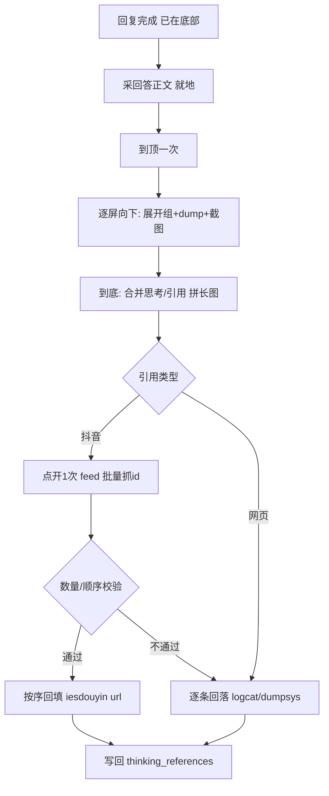

# 问答采集：流程去重 + 链接批量提速

## 目标
- 消除当前 3+ 次全程「到顶↔到底」往返，合并为 `到顶一次 → 向下一趟`，解析接底部单趟。
- 引用链接：抖音（12/14）走一次点开批量抓取 + 严格校验回落；全程用常驻 logcat 流替代逐条 clear/多次 dump。

## 一、流程去重（问题1）
文件 [app/modules/qa_capture.py](app/modules/qa_capture.py)

- `_capture_answer_body_early`(155): 回复完成后本就在底部，改为轻量确认，不再无条件 `_scroll_to_bottom`。
- **合并 `_expand_and_collect`(771) 与 `_capture_full_screenshots`(561) 为单趟 `到顶→逐屏向下`**：每屏顺序执行「展开可见搜索组 → settle → dump(思考/引用) → 截图帧(复用 `roi_pair_metrics` 去重)」，到底结束；保留 `_merge_thinking_panels` 合并多轮 dump。
- 删除 `run()`(980) 中冗余的 `_scroll_exchange_into_view` 上扫，以及截图函数内二次 `_scroll_message_to_top`。
- `_resolve_reference_urls`(716): 合并趟结束后已在底部，去掉再次 `_scroll_to_thinking_panel` 回顶；直接底→顶单趟解析（现有已按 bounds 自底向上排序）。

## 二、链接批量提速（问题2，gated 策略）
文件 [app/modules/qa_reference_urls.py](app/modules/qa_reference_urls.py)、[capture/utils/capture_logcat.py](capture/utils/capture_logcat.py)

- **常驻 logcat 流**：解析开始 `clear_logcat` 一次后启动单个 `adb logcat` 子进程，`_resolve_one_citation_url`(343) 每次点击只读「新增行」，移除逐条 `clear_logcat`+sleep 与 `poll_logcat_for_url`(139) 里反复 spawn 的 `dump_logcat_tail`。
- **抖音批量快路径（gated）**：
  - 点开第 1 条抖音引用 → 进入内置抖音 feed → 从流中抓齐所有 `snssdk1128://aweme/detail/<id>`。
  - 校验：`distinct(id) 数量 == 抖音引用条数` 且顺序单调 → 按顺序用 `_iesdouyin_url` 批量回填（O(1)）。
  - 不满足 → 自动逐条回落（沿用现有 auto: logcat→dumpsys）。
- **网页引用**：少量逐条解析 `link_url=`（保持现状逻辑，走常驻流）。
- **精简回退**：`safe_back_to_chat` 单次定向 back + 一次 `app_current` 校验，去掉多轮循环等待。

## 三、配置与测试
- [app/config/gesture_profile.py](app/config/gesture_profile.py)(200-220): 新增 `qa_resolve_batch_douyin: bool=True`、`qa_logcat_stream_settle`；复用现有 `qa_shot_*`/`qa_resolve_*`。
- [tests/test_qa_reference_urls.py](tests/test_qa_reference_urls.py): 新增「批量 logcat 文本 → 多 id 顺序抽取 + 数量校验回填 / 不匹配回落」样本测试（无需真机）。
- 真机验收：`fast` 模式跑一次，目标 14/14 链接齐全、`thinking.md` 完整，总耗时较现状明显下降；关键校验 title↔url 未错配。

## 数据流
