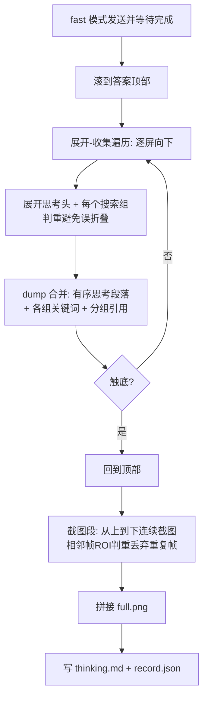

## 豆包问答采集改进（第三轮）

关键认知修正：**快速模式同样有「已完成思考 + 多轮搜索引用」**，所以思考/引用抓取不再受 `mode` 门控；本轮统一在 fast 模式下运行与验证（issue 5）。只改 [app/modules/qa_capture.py](app/modules/qa_capture.py)、[app/modules/qa_hierarchy.py](app/modules/qa_hierarchy.py)、[app/config/gesture_profile.py](app/config/gesture_profile.py)、[run_qa_capture.py](run_qa_capture.py)、[doc/qa_capture.md](doc/qa_capture.md)、测试；电商流程零改动。

### 新采集流程（展开-收集 与 截图 分两段）

### 1. fast 也抓思考/引用（issue 1、5）
- [run_qa_capture.py](run_qa_capture.py) 默认 `--mode fast`（保持），`run()` 里去掉 `if mode == "think"` 门控，思考/引用采集**始终执行**。
- `_select_mode("fast")` 选「快速」；不再测试 think/专家。

### 2. 思考正文与多轮引用解析（issue 3、1）
重写 [app/modules/qa_hierarchy.py](app/modules/qa_hierarchy.py) 的 `parse_thinking_panel`：
- 思考正文：收集 `sub_deep_think_block_list` 区域内**所有实义段落 TextView**（按 y 排序，去掉 header、搜索组标题、引用条目），不再要求含“思考/搜索”关键词——修复只拿到第一句的问题。
- 关键词：`search_key_words` 全量收。
- 引用：每条 `tv_reference_content` 按 y 归入其**最近的上方 `search_reference_title`**，`Citation` 增 `group` 字段；保留 `ref_index`。
- 新增 `render_thinking_markdown(panel)`：输出「思考正文 → 各搜索组(关键词 + 编号引用列表)」结构化 markdown。

### 3. 展开-收集遍历（issue 1、3、4-expand、5）
[app/modules/qa_capture.py](app/modules/qa_capture.py) 用 `_expand_and_collect(session_dir)` 取代现有 `_capture_thinking_references` 的分散逻辑：
- 先 `_scroll_message_to_top()`；确保思考头展开（折叠则点 `ll_reference_title`）。
- 循环逐屏向下：每屏先**展开当前可见但未展开的搜索组**（`searchReferenceTitleContainer`；仅当其下方无 `ll_source_item` 时才点，避免把已展开的折叠回去），展开后 re-dump；`parse_thinking_panel` 解析并按“文本归一化去重、首见顺序”合并到累积结果；再向下滑一屏（带重叠），ROI `metric_quiet` 连续静止判触底。
- 合并逻辑集中在 `_merge_thinking_panels`，扩展为保序 + 按 `group` 归类。

### 4. 干净连续长截图 + 去重（issue 2、4）
`_capture_full_screenshots` 改为在**展开-收集完成后**执行：
- 回到顶部，逐屏截图；追加前用 `roi_pair_metrics`/`metric_quiet`（复用 [app/modules/web_detail_capture.py](app/modules/web_detail_capture.py)）与**上一张保留帧**比较，静止即丢弃该重复帧并计入静止计数，连续静止 `qa_shot_quiet_rounds` 次停止。
- 仅对**保留的去重帧**调用 `stitch_content_strips_vertical`（[app/modules/detail_strip_stitch.py](app/modules/detail_strip_stitch.py)），短内容只留 1 帧 → full.png 不再重复拼接。

### 5. 记录与文档（issue 5）
- `_save_record` 写 `thinking.md`（`render_thinking_markdown` 结果），`record.thinking` 存该 markdown；`thinking_references.json` 增 `group` 字段；保留 `record.json`。
- 更新 [doc/qa_capture.md](doc/qa_capture.md)：说明 fast 模式也含思考/引用、展开-收集与两段截图、thinking.md 结构。
- 补 [tests/test_qa_hierarchy.py](tests/test_qa_hierarchy.py)：`parse_thinking_panel` 断言多段思考正文（>1 段）、引用带 `group`、`render_thinking_markdown` 含各搜索组标题。

### 注意
- 遵守 code-style：早返回、`for` 嵌套 <3、具体异常 + 中文日志、选择器全固化（无模型/OCR）。
- 搜索组展开判重要稳，避免误折叠导致漏抓。