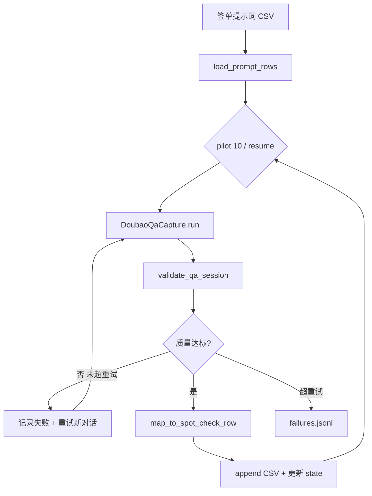

# 豆包 APP 抽检明细 CSV 批量采集

## 背景与数据对齐

| 来源 | 文件 | 作用 |
|------|------|------|
| 提示词输入 | [`var/vivo-x-fold6/签单提示词导出_20260710_183049.csv`](var/vivo-x-fold6/签单提示词导出_20260710_183049.csv) | 123 条提示词 + **意图绑定**（`意图编号`/`意图名称`/`词包编号`/`一级分类`/`品牌编号` 等） |
| 产出格式参考 | [`var/vivo-x-fold6/抽检明细_20260709_每提示词一条_20260710_184652.xlsx`](var/vivo-x-fold6/抽检明细_20260709_每提示词一条_20260710_184652.xlsx) | 29 列 schema；123 条 vivo 提示词已全部存在于 xlsx（可作字段对照） |
| 采集能力 | [`run_qa_capture.py`](run_qa_capture.py) + [`app/modules/qa_capture.py`](app/modules/qa_capture.py) | 单条问答：正文 / thinking / `thinking_references` / 截图 / 质量门禁 |

**平台约定（已确认）**：`AI平台代码=DB`，`AI平台名称=豆包`，`终端平台=APP`（与参考 xlsx 的 DS/PC 区分，反映真实采集来源）。

**范围（已确认）**：先 **试点 10 条**（跨意图抽样），格式与质量通过后 `--resume` 续跑全量 123 条。

## 目标产出

```
var/vivo-x-fold6/
├── 抽检明细_20260710_APP采集.csv      # 主产出（29 列，与 xlsx sheet 一致）
├── spot_check_state.json              # 断点：已完成关键词编号、失败次数、session_dir
└── spot_check_failures.jsonl          # 失败明细（可人工复查）
```

采集原始归档仍落 [`logs/qa_capture/`](logs/qa_capture/)（每提示词一次 `session_dir`）。

## 列映射（签单 CSV + QaRecord → 抽检行）

参考 xlsx 表头（29 列）：

```
项目名称, 抽检日期, 明细ID, 抽检明细编号, 任务编号, 任务批次编号,
提示词, 渠道关键词, 关键词编号,
AI平台代码, AI平台名称, 终端平台,
任务状态, 抽检时间, 修改时间,
回答字数, 思考字数, 引用条数, 质量分级,
意图名称, 意图编号, 词包编号, 一级分类, 合作标识, 品牌编号, 品牌名称,
AI回答正文, AI思考内容, 引用列表
```

| 抽检列 | 来源 |
|--------|------|
| 项目名称 / 意图* / 词包* / 一级分类 / 合作标识 / 品牌* | 签单 CSV 同名字段（`一级分类` ← `一级分类(PP/PL/CN)` 或 `词包一级分类`） |
| 提示词 | `提示词` |
| 渠道关键词 | `提示词`（与 xlsx 一致） |
| 关键词编号 | `提示词编号` |
| AI平台* / 终端平台 | 固定 `DB` / `豆包` / `APP` |
| 任务状态 | `4`（与参考样本一致，表示完成） |
| 抽检时间 / 修改时间 | 采集完成时刻 `YYYY-MM-DD HH:MM:SS` |
| 抽检日期 | 当日 `YYYY-MM-DD` |
| 明细ID | 本地自增（从 `900001` 起，写入 state 持久化） |
| 抽检明细编号 | `TD` + `关键词编号` 后 32 位（稳定、可复现） |
| 任务编号 | 单次批次固定 `TN` + 日期哈希（同批共用） |
| 任务批次编号 | 空（与 xlsx 一致） |
| AI回答正文 | `record.answer_body` |
| AI思考内容 | 从 `record.thinking` 提取 `### 思考过程` 段落；若仅为「搜索 N 篇资料」占位，则拼接各组 `**搜索关键词：**` 摘要作为兜底 |
| 回答字数 / 思考字数 / 引用条数 | `len(正文)` / `len(思考)` / `len(thinking_references)` |
| 引用列表 | `thinking_references` → JSON 数组，schema 对齐 xlsx：`{source, title, urlNum, webUrl}` |
| 质量分级 | 基于 [`qa_quality.validate_qa_session`](app/modules/qa_quality.py)：全通过且 URL 全量 → `S`；score≥80 → `A`；否则 `B`/`F` |

### 引用列表转换规则

[`Citation`](app/modules/qa_hierarchy.py) → xlsx 条目：

- `urlNum`：按 `ref_index` 或枚举顺序 1..N
- `webUrl` ← `url`
- `title`：去掉标题末尾 `（来源名）` 后缀
- `source`：优先 `Citation.source`；否则从标题 `（…）` 解析；再否则从 URL 域名推断（如 `pconline.com.cn` → `太平洋科技` 的简单映射表 + 域名 fallback）

## 架构



## 实现文件

### 1. [`app/modules/qa_spot_check_export.py`](app/modules/qa_spot_check_export.py)（新建）

- `SpotCheckRow` dataclass（29 字段）+ `COLUMNS` 常量
- `load_signed_prompts(csv_path) -> list[SignedPromptRow]`：读签单 CSV，校验必填列
- `select_pilot_rows(rows, n=10)`：按 `意图名称` 分组后 round-robin 取 10 条（覆盖尽量多意图）
- `extract_thinking_narrative(thinking_md: str) -> str`
- `citations_to_spot_check_json(refs) -> str`
- `qa_record_to_spot_check_row(signed, record, quality_report, meta) -> SpotCheckRow`
- `append_csv_row(path, row)` / `load_completed_keyword_ids(path) -> set`

### 2. [`run_qa_spot_check.py`](run_qa_spot_check.py)（新建入口）

```bash
# 试点 10 条
python run_qa_spot_check.py \
  --prompts-csv var/vivo-x-fold6/签单提示词导出_20260710_183049.csv \
  --out-csv var/vivo-x-fold6/抽检明细_20260710_APP采集.csv \
  --pilot 10 \
  --mode fast \
  --strict

# 全量续跑（跳过 CSV 中已有 关键词编号）
python run_qa_spot_check.py --resume --strict
```

关键参数：`--pilot N`、`--resume`、`--limit`、`--mode fast`（黄金路径）、`--max-retries 2`、`-s` 设备序列号。

**批处理循环**（每条提示词）：
1. 读 state / CSV，跳过已完成
2. 调用 `DoubaoQaCapture.run(prompt=..., mode=fast)`（进程内直调，非 subprocess）
3. `validate_qa_session(..., require_all_urls=True)`；未达标则 **新建对话重试**（最多 2 次）
4. 映射行 → **立即 append CSV**（防中断丢数据）→ 更新 `spot_check_state.json`
5. 终端打印进度 `[抽检] 3/10 意图=AI折叠手机推荐 质量=S session=...`

### 3. [`tests/test_qa_spot_check_export.py`](tests/test_qa_spot_check_export.py)（新建）

- 用黄金样本 [`logs/qa_capture/2026-07-10/145156/record.json`](logs/qa_capture/2026-07-10/145156/record.json) + 签单 CSV 中「折叠手机推荐」对应行，断言：
  - 29 列齐全、意图字段与签单 CSV 一致
  - `引用列表` JSON 可解析且含 `urlNum`/`webUrl`
  - `关键词编号` 与输入绑定不变

### 4. [`doc/qa_capture.md`](doc/qa_capture.md)（补一节）

简述抽检批跑入口、CSV 列含义、DB/APP 与参考 xlsx 的差异、断点续跑用法。

## 试点 10 条选取策略

从 13 个意图中 round-robin 各取 1 条（前 10 个意图各 1 条），优先覆盖：

`AI折叠手机推荐`、`OPPO Find N6竞品对比`、`出差折叠手机推荐`、`办公商务折叠手机`、`性价比折叠手机推荐`、`折叠手机推荐`、`新款手机资讯`、`旗舰手机推荐`、`旗舰拍照推荐`、`演唱会拍摄`

（确保竞品对比 3 条、观赛 3 条等小意图也有代表，但 pilot 总量仍为 10）

## 监控与漏洞修复策略

| 风险 | 监控 | 修复方向 |
|------|------|----------|
| 正文/引用/URL 不全 | `validate_qa_session` + `--strict` | 重试；仍失败记入 failures.jsonl，不污染 CSV |
| 发送/等待超时 | 捕获 `wait_reply_done` 失败日志 | 重开对话重发；必要时延长 timeout |
| 思考内容过短 | 映射后 `思考字数 < 20` 打 warning | 改进 `extract_thinking_narrative` 兜底拼接关键词 |
| `source` 为空 | 映射后统计空 source 比例 | 完善标题括号解析 + 域名映射 |
| 中断丢进度 | 每行写完即 flush CSV | `--resume` 按 `关键词编号` 跳过 |
| 意图绑错 | 行映射只用签单 CSV 字段，不用采集结果推断 | 单测锁定 |

试点完成后人工对照：随机抽 2 行与 xlsx 同提示词行比字段结构（不要求正文一致，因平台不同）。

## 验收标准

1. 试点 CSV 恰好 **10 行** + 表头，29 列与 xlsx 一致
2. 每行 `意图名称`/`意图编号`/`词包编号` 与签单 CSV 对应行完全一致
3. `引用列表` 为合法 JSON；`webUrl` 覆盖率 ≥ 90%（试点目标；全量 `--strict` 要求 100%）
4. `pytest tests/test_qa_spot_check_export.py` 通过
5. 试点通过后，一条命令 `--resume` 可续跑剩余 113 条
