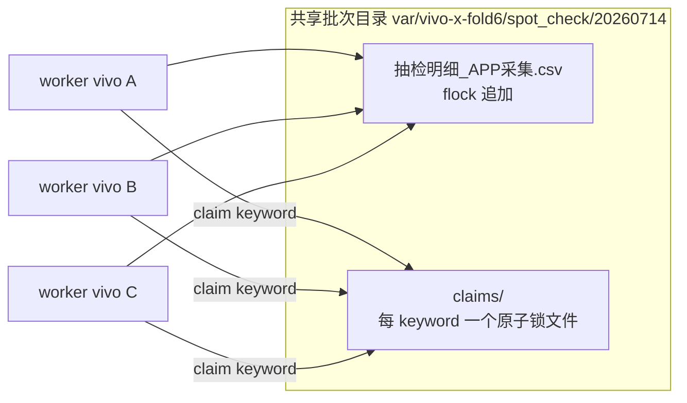

# xfold6 多机并发协作抽检 + 荣耀跑雅诗兰黛

## 现状核实（已确认）

- **4 台设备**：
  - `10ADBY1Z7C0042Z` vivo V2301A — app 已装，**当前在跑雅诗兰黛**
  - `10AE3B0DSU0063K` vivo V2301A — **app 未安装**（新机）
  - `10AE3F0PNK00657` vivo V2301A — **app 未安装**（新机）
  - `46H0219118001437` HONOR PCT-AL10 — app 已装（原 xfold6 机）**（本次plan不用执行这台机器）**
- **机型/profile**：三台 vivo 均为 `vivo/V2301A` → 自动匹配 `[app/config/profiles/vivo_v2301a.json](app/config/profiles/vivo_v2301a.json)`（真实已适配）。`[app/config/profiles/vivo_x_fold6.json](app/config/profiles/vivo_x_fold6.json)` 只是另一款未接入设备的占位，Neo8 不使用它。已适配两种 = `vivo_v2301a` + `honor_pct_al10`。
- **需要交换**：现状是雅诗兰黛在 vivo、xfold6 归荣耀；目标是荣耀跑雅诗兰黛、三台 vivo 跑 xfold6。
- **并发缺口**：`[run_qa_spot_check.py](run_qa_spot_check.py)` 启动时一次性算好 `todo` 后顺序跑，**无逐条原子认领**；`[app/modules/qa_spot_check_export.py](app/modules/qa_spot_check_export.py)` 的 `append_csv_row`/state 无跨进程锁；`[scripts/run_unattended_spot_check.sh](scripts/run_unattended_spot_check.sh)` 的 `spot_check.lock.d` 只允许单 worker。→ 三机指向同一队列会**重复采集 + 写坏 CSV/state**，必须加认领层。

## 方案：共享原子认领队列（动态均衡，不重复不漏）

- **认领**：新模块 `app/modules/spot_check_claims.py`，`claim_task()` 用 `os.open(O_CREAT|O_EXCL)` 原子建 `claims/<keyword_id>.json`（记 worker_id/pid/时间）。已存在→读，若超时(`--claim-stale-sec`)且属主进程已死则接管，否则跳过。`release_task()` 失败时删锁供他机重试。
- **不漏**：worker 循环遍历全量去重行，直到一整轮无可认领行才退出；已完成以 CSV（`load_completed_keyword_ids`）为准。
- **不重复**：认领互斥 + 完成以 CSV 去重；`detail_id` 改为**确定性**（`900001 + 去重列表内稳定序号`），去掉 state.json 里 `next_detail_id` 的跨进程竞争。
- **写安全**：`append_csv_row` 外加 `fcntl.flock`（`<csv>.lock`）。

## 具体改动

### 1. 停旧 + 交换（先做，不改码）

- 停当前 vivo 上的雅诗兰黛 worker 与荣耀 xfold6 worker（各自 serial 精准停，`screen -X quit` + `pkill -f`）。
- 改 `[var/雅诗兰黛/run_unattended.sh](var/雅诗兰黛/run_unattended.sh)`：`ADB_SERIAL` → `46H0219118001437`；品牌/型号护栏改 `HONOR`/`PCT-AL10`；`SMS_DEVICE_ID` → 荣耀专属；保留 `SPOT_CHECK_ALLOW_PARTIAL_DOUYIN_URLS=0`。荣耀上 `--resume` 续跑（已完成 6 条保留）。

### 2. 认领队列实现（核心改码）

- 新增 `app/modules/spot_check_claims.py`（claim/release/steal + flocked append）+ `tests/test_spot_check_claims.py`（双认领、超时接管、释放重认领、并发模拟）。
- 改 `[run_qa_spot_check.py](run_qa_spot_check.py)`：加 `--claims-dir`（默认 `<state 目录>/claims`）、`--worker-id`（默认 serial）、`--claim-stale-sec`；改主循环为「遍历→认领→采集→locked 追加→失败释放」；`detail_id` 确定性化。未传 `--claims-dir` 时保持旧单机行为（向后兼容，雅诗兰黛仍单机）。

### 3. 无人值守脚本支持多机

- 改 `[scripts/run_unattended_spot_check.sh](scripts/run_unattended_spot_check.sh)`：支持 `SPOT_CHECK_SERIALS`（空格分隔）→ 每 serial 起一个 worker，锁/pid/screen **按 serial 隔离**，共享 `BATCH_DIR/OUT_CSV/STATE/claims`，按 serial 注入 `SMS_DEVICE_ID`，传 `--claims-dir/--worker-id`；`stop/status` 汇总本批次全部 worker + CSV 进度 + claims 计数。单 serial 老路径不变。
- 新增 `var/vivo-x-fold6/run_multi.sh`（不入 git）：设三台 vivo serial、复用批次 `spot_check/20260714`（自动跳过已完成、只认领剩余）、每台独立 `SMS_DEVICE_ID`、`ALLOW_PARTIAL_DOUYIN=1`。

### 4. 两台新 vivo 装机 + 适配（同型号，走快检非全量 S01–S07）

- 从已跑通的 `10ADBY1Z7C0042Z` `adb pull` base.apk（或用 `[var/apk/com.larus.nova/com.larus.nova_14.1.0.apk](var/apk/com.larus.nova)`），`install` 到两台新机，保证版本一致。
- 每台 `python -m uiautomator2 init`。
- 每台 SMS 登录（游客→SMS，**各用独立 `SMS_DEVICE_ID`/号码**；如需抖音同号登录一并处理）。
- 每台 1 条冒烟：`scripts/run_douyin_url_probe.py -s <serial>` 或 `run_qa_spot_check.py --pilot 1`，确认 `vivo_v2301a` profile 直接可用后再入队。

### 5. 启动与验收

- `bash var/vivo-x-fold6/run_multi.sh start` 起三台 vivo；`bash var/雅诗兰黛/run_unattended.sh start` 起荣耀。
- 验收「不重复不漏」：CSV `关键词编号` 无重复、claims 数 = 已认领数、最终完成数收敛到签单去重总数（xfold6 TOTAL=123）；`status` 观察三机动态分担、快机多领。

## 待你确认/提供

- 每台的 `SMS_DEVICE_ID`→号码映射：我会用按 serial 命名的 device_id（如 `doubao-crawler-vivo-<serial尾4>`），**需确保这些 device_id 在短信平台已绑定真实号码**；冒烟阶段若某号未开通会立即暴露。

