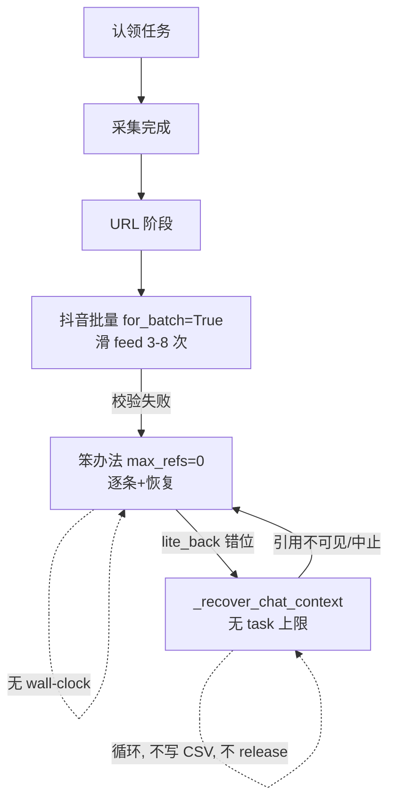

# xfold6 四机抽检空转治理

## 结论（一句话）
空转不是"抢不到活"，而是 4 台里 2 台卡在单条任务的 URL/抖音批量/会话恢复循环里反复失败：**进程活着、claim 占着、CSV 不落盘**，直到 `claim_stale_sec=3600s` 才可能被别人抢。叠加"PC Web 验证仍进抖音 feed 滑屏"和"URL 阶段无任何 wall-clock 时限"，把有效并行度从 4 拉到 ~2。

## 代码已核实的根因
- **抖音 feed 滑屏未受 `qa_douyin_web_validate` 门控**：`try_batch_resolve_douyin`（[app/modules/qa_reference_urls.py](app/modules/qa_reference_urls.py) 1210-1214）中 `feed_swipes = max(3,min(count,8)) if qa_resolve_accept_app_jump else 0`；批量走 `for_batch=True`，绕过了 [app/modules/douyin_handoff.py](app/modules/douyin_handoff.py) 320 的 PC Web 早退，仍在 350-357 滑 feed。vivo profile 两开关都为 true。
- **URL 阶段无整体时限**：`resolve_thinking_reference_urls`（qa_reference_urls.py 2465-2640）三阶段无 wall-clock；`_resolve_pending_pass`（2351-2462）笨办法 pass `max_refs=0`（不限条数）；`_recover_chat_context`（1003-1038）每条引用可各触发一次含 `hard_restart_app` 的三级恢复，**无 task 级上限**。
- **claim 只在 `capturer.run()` 返回后才 release**（[run_qa_spot_check.py](run_qa_spot_check.py) 215-228）；URL 阶段 hang → claim 占 1 小时。崩溃/被杀**无自动 release**（`spot_check_claims.py` 无 atexit/signal）。
- **监控只在全员 down 才续跑**（[scripts/monitor_spot_check.sh](scripts/monitor_spot_check.sh) 79-117）；无"按 serial 检测卡死"。
- 会话搜索页（`CombineSearchActivity`）其实已由 `dismiss_conversation_search`（[app/modules/navigator.py](app/modules/navigator.py) 485-508）覆盖并在恢复链前置调用，**P1 搜索页基本已修**，仅需回归确认。

---

## Phase 0 — 最小安全缓解（不改业务代码，先把剩余 11 条跑完）
目标：立即止血、只动 2 台空转机（042Z/063K），另 2 台（0657/Honor）不打扰。

- **改 profile 关掉抖音 feed 滑屏**：[app/config/profiles/vivo_v2301a.json](app/config/profiles/vivo_v2301a.json) 设 `qa_resolve_accept_app_jump: false`（web_validate 下批量 `feed_swipes` 归零；单条本就走 PC Web 不开抖音）。可选再 `qa_resolve_batch_douyin: false` 直接跳批量走逐条 logcat+PC 验证。
- **加"按 serial 卡死看门狗"脚本**（新文件 `scripts/watch_stuck_worker.sh`）：轮询 `claims/*.json`，对某 serial 若 `claimed_at` 超过阈值（默认 25min）且 CSV 未增长 → 只对该 serial `stop_worker_serial` + 删该 claim + `start_worker`，不碰其它 worker。
- **只重启 2 台空转机**：`SPOT_CHECK_SERIALS="10ADBY1Z7C0042Z 10AE3B0DSU0063K" bash var/vivo-x-fold6/run_multi.sh restart`，让其加载新 profile；同时清掉这两台的僵尸 claim。
- 观察 CSV 从 112 → 123；期间 0657/Honor 继续跑。

## Phase 1 — URL 阶段硬化（根因修复，跑通单测后整体重启四台）
- **P0 feed 门控**：`try_batch_resolve_douyin`（qa_reference_urls.py ~1210）当 `profile.qa_douyin_web_validate` 为真时 `feed_swipes=0`，且批量 1 次失败即回落逐条（不再二次 accept jump + 手动 swipe，1244-1256 分支同步跳过）。
- **P0 URL 阶段 wall-clock**：`resolve_thinking_reference_urls` 开头记 `deadline`（新 profile 字段 `qa_resolve_url_phase_budget_sec`，默认如 480s）；三阶段之间与 `_resolve_pending_pass` 循环头（2376）检查，超时即停止、**返回已解析的 partial citations**（配合 allow-partial=1 仍能落 CSV + release claim）。
- **P1 恢复上限**：`_resolve_pending_pass` 内对 `_recover_chat_context`/`hard_restart_app` 加 task 级计数上限（新字段 `qa_resolve_recover_max_per_task`，默认如 3），超限即结束该 pass。
- **P0 崩溃自动 release**：[run_qa_spot_check.py](run_qa_spot_check.py) 认领后注册 atexit/SIGTERM 处理，释放当前 worker 持有的 claim。
- 单测：扩展 [tests/test_qa_reference_urls.py](tests/test_qa_reference_urls.py)（web_validate 下 feed_swipes=0、超时返回 partial、恢复上限）、[tests/test_douyin_handoff.py](tests/test_douyin_handoff.py)（注：现存 `test_apply_batch_douyin_urls_pc_web_validate` 已 FAIL，需一并修）。

## Phase 2 — 多机抢占/看门狗/可观测性（固化）
- **缩短 claim 抢占窗口**：`--claim-stale-sec` 从 3600 降到如 1500（run_multi.sh / run_unattended_spot_check.sh），让健康 worker 更快抢下僵死任务。
- **看门狗并入常驻监控**：把 Phase 0 的 `watch_stuck_worker.sh` 逻辑接入 `run_unattended_spot_check.sh` 的 monitor screen，随 `start` 自动拉起。
- **可观测性**：`[问答]`/`[URL]` 关键行带 `worker=<serial>`；或每 worker 独立日志文件（`spot_check_run.<suffix>.log`），便于按机过滤。

## 验证与交付
- Phase 0 后：CSV 到 123/123，导出交付。
- Phase 1/2 后：`pytest tests/test_qa_reference_urls.py tests/test_douyin_handoff.py` 全绿；观察新一轮日志 `会话错位`/`引用不可见`/`抖音批量校验失败` 显著下降，单条 URL 阶段有上限、四机有效并行接近 4。