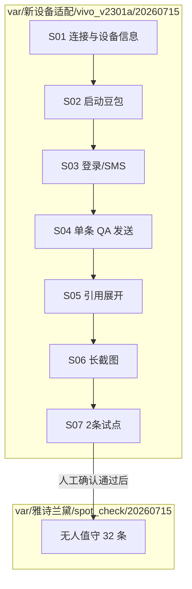

# 雅诗兰黛新手机（vivo V2301A）适配与抽检计划

## 现状与策略调整

| 项 | 值 |
|---|---|
| 新手机 | vivo V2301A，serial `10ADBY1Z7C0042Z`，1260×2800，**豆包已安装，全流程未跑通** |
| 荣耀机 | 继续 `spotcheck_vivo_worker`（并行，不干扰） |
| 雅诗兰黛旧批次 | `var/雅诗兰黛/spot_check/20260714/` 荣耀已完成 32/32 |
| 本次工作方式 | **分步调试 + 每步记录 + 必要截图 + 人工卡点**；**不**直接上无人值守全量 |

**核心路径变更**：所有初期调试产出放在

```
var/新设备适配/vivo_v2301a/20260715/
```

启动脚本 **`run_adapt.sh` 也放在此目录**；正式 `var/雅诗兰黛/run_unattended.sh` 仅在沙箱步骤全部通过后再启用。



---

## 阶段 0：适配沙箱目录与启动脚本

### 目录结构（执行时创建）

```
var/新设备适配/vivo_v2301a/20260715/
├── run_adapt.sh              # 本阶段唯一启动入口（status / step / pilot / unattended-迁移）
├── ADAPT_LOG.md              # 步骤流水账（人工可读，每步结果/阻塞/下一步）
├── device_info.json          # brand/model/serial/分辨率/profile key
├── steps/                    # 分步证据
│   ├── S01_connect/
│   │   ├── screen.png
│   │   └── notes.md
│   ├── S02_start_app/
│   ├── S03_login/
│   ├── S04_send_qa/
│   ├── S05_refs/
│   ├── S06_longshot/
│   └── S07_pilot2/
├── qa_capture/               # run_qa_capture 产出（--out-dir 指向本目录）
├── spot_check/               # 沙箱内 mini 试点 CSV/state（S07）
│   ├── 抽检明细_APP采集.csv
│   └── spot_check_state.json
└── adapt_run.log             # 命令与终端输出追加
```

### `run_adapt.sh` 职责（本地脚本，不入 git）

- `ROOT`、**固定** `ADB_SERIAL=10ADBY1Z7C0042Z`、vivo 品牌/型号校验
- `source .env`（SMS 凭证）；`SMS_DEVICE_ID=doubao-crawler-vivo-v2301`
- 子命令示例：
  - `./run_adapt.sh status` — adb 设备 + 豆包包名 + 当前 Activity
  - `./run_adapt.sh snap S03_login` — 截图 + `dumpsys activity` 写入 `steps/S03_login/`
  - `./run_adapt.sh step 4` — 跑 ADAPT_LOG 中第 N 步对应命令
  - `./run_adapt.sh pilot` — S07：2 条雅诗兰黛提示词，产出写到本目录 `spot_check/`
  - `./run_adapt.sh migrate` — 打印/生成 `var/雅诗兰黛/...` 正式脚本（**仅 S07 通过后**）

**不**在本阶段创建或启动 `spotcheck_estee_worker` screen，避免无人值守掩盖单步问题。

---

## 阶段 1：分步调试清单（S01–S07）

每步执行后**必须**更新 `ADAPT_LOG.md`（时间、命令、结果 pass/fail/block、截图路径）。失败时**优先调** [`vivo_v2301a.json`](app/config/profiles/vivo_v2301a.json)，必要时人工介入后再继续。

| 步骤 | 目标 | 命令/工具 | 证据 | 人工卡点 |
|------|------|-----------|------|----------|
| **S01** | adb 连通、型号正确 | `adb -s … get-state`；写 `device_info.json` | `steps/S01_connect/screen.png` | 确认 USB 调试已授权 |
| **S02** | 冷启动进豆包 | `run_qa_capture.py --skip-send --out-dir <沙箱>` 或 `start_app` 路径 | Activity 日志 + 截图 | 若卡权限/弹窗，人工点掉后 `snap` 再续 |
| **S03** | 登录态 / SMS | 自然落到登录页才触发 SMS（见 §SMS 策略） | 登录页截图 + hierarchy xml | Token 空则人工登录；SMS 失败 dump 校准 `sms_login.py` |
| **S04** | 新会话 + 快速模式 + 发送 | `run_qa_capture.py --prompt "…" --mode fast`（雅诗兰黛短句） | `qa_capture/…/record.json`、发送前后截图 | 模式未切到「快速」则停下调 profile/UI |
| **S05** | 引用面板展开与 xpath | 选**有引用**的提示词；对照 hierarchy | `steps/S05_refs/` dump + 展开后截图 | 引用列表找不到 → 只调 profile xpath/viewport |
| **S06** | 长截图完整 | 同上条或更长回答 | `full.png` 屏数、`steps/S06_longshot/` | 仅 1 屏或重复 → 调 `qa_shot_*` profile |
| **S07** | 2 条试点 | `run_qa_spot_check.py --pilot 2 --out-dir <沙箱>/spot_check` | CSV 2 行 + 质量分 | **你确认 OK 后才 migrate** |

### 截图与 dump 工具（已有，按需选用）

| 场景 | 工具 |
|------|------|
| 单步快照 | `adb -s SERIAL exec-out screencap -p > steps/Sxx/screen.png` |
| 界面变化自动录 | `python recon/ui_spy.py -s SERIAL`（输出到 `steps/` 或 `logs/`，可 `--interval 1.5`） |
| 操作全程录 | `python recon/flow_recorder/recorder.py`（引用展开等复杂路径） |
| UI 树 | `adb shell uiautomator dump` + pull，存 `steps/Sxx/hierarchy.xml` |
| QA 采集自带 | `run_qa_capture` session 内 `shot_*.png`、`full.png` |

**原则**：每步至少 1 张截图 + `ADAPT_LOG.md` 一行结论；阻塞步骤额外保留 hierarchy。

---

## SMS 自动登录（惰性，不变）

> **只有**豆包落在 Login Activity 且无法继续问答时，才调 SMS API。

- gate：[`handle_login_if_needed`](app/modules/flow_crawler.py) → 仅 `nav.is_login()` 时 `auto_login()`
- worker 启动、S01–S02、单独 snap：**不**取号
- `.env` 由 `run_adapt.sh` source；`SMS_DEVICE_ID=doubao-crawler-vivo-v2301` 与荣耀并行隔离

---

## 阶段 2：机型 profile

新建 [`app/config/profiles/vivo_v2301a.json`](app/config/profiles/vivo_v2301a.json)（基线 [`honor_pct_al10.json`](app/config/profiles/honor_pct_al10.json)）：

- `default_screen_width/height`: 1260 / 2800
- `qa_ref_list_probe_xpaths`、`qa_resolve_viewport_*`、`qa_shot_*`

**S05/S06 每失败一次，先改 profile 再重跑该步**，不先改通用 Python。

---

## 阶段 3：迁入雅诗兰黛正式批次（S07 人工通过后）

仅当 `ADAPT_LOG.md` 中 S01–S07 均为 pass 且你确认后：

1. 创建/更新 [`var/雅诗兰黛/run_unattended.sh`](var/雅诗兰黛/run_unattended.sh)：
   - `SPOT_CHECK_BATCH_DIR=var/雅诗兰黛/spot_check/20260715`
   - `ADB_SERIAL=10ADBY1Z7C0042Z`
   - 复用已验证的 profile 与 SMS 配置
2. `bash var/雅诗兰黛/run_unattended.sh start` → 32 条全量
3. 沙箱目录 **保留** 作适配证据，不删除

---

## 故障 playbook（适配阶段）

| 症状 | 优先动作 | 证据位置 |
|------|----------|----------|
| adb 未授权 | 人工点授权 → S01 重跑 | `S01_connect/` |
| 启动非 Chat/Login | 截图 + Activity；调导航或人工关弹窗 | `S02_start_app/` |
| 登录页 SMS 失败 | dump 登录页 rid；人工或改 `sms_login.py` | `S03_login/` |
| 发不出消息 / 模式错 | 截图模式菜单；profile 或 `_select_mode` | `S04_send_qa/` |
| 引用 URL=0 | profile xpath/viewport | `S05_refs/` |
| 长图截断 | profile `qa_shot_*` | `S06_longshot/` |
| 质量不达标 | 看 `record.json` + failures，回退到对应 S 步 | `spot_check/` |

---

## 涉及文件

| 文件 | 动作 |
|------|------|
| `var/新设备适配/vivo_v2301a/20260715/run_adapt.sh` | **新建**（本阶段主入口） |
| `var/新设备适配/vivo_v2301a/20260715/ADAPT_LOG.md` | **新建**（步骤流水） |
| [`app/config/profiles/vivo_v2301a.json`](app/config/profiles/vivo_v2301a.json) | **新建**，随 S05–S06 迭代 |
| [`var/雅诗兰黛/run_unattended.sh`](var/雅诗兰黛/run_unattended.sh) | **S07 通过后再改** |
| [`recon/ui_spy.py`](recon/ui_spy.py) / [`run_qa_capture.py`](run_qa_capture.py) | 只读调用，分步调试 |
| [`.env`](.env) | SMS 凭证（勿提交 git） |

## 预期产出

**适配阶段（先完成）**

```
var/新设备适配/vivo_v2301a/20260715/
  ADAPT_LOG.md          # 每步 pass/fail + 截图索引
  steps/S01…S07/        # 分步证据
  qa_capture/…
  spot_check/           # pilot 2 条
```

**正式阶段（S07 通过后）**

```
var/雅诗兰黛/spot_check/20260715/   # 32 条无人值守
```
