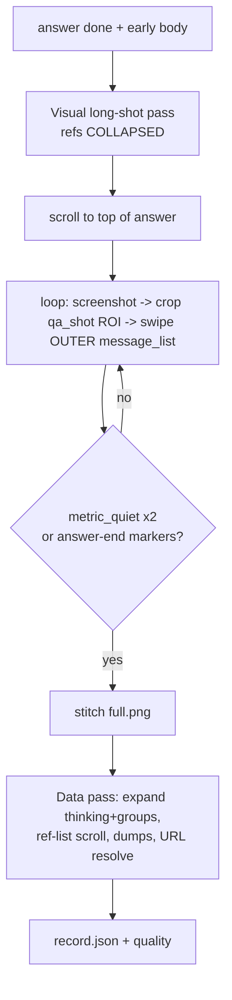

## Root cause (confirmed)

In [app/modules/qa_capture.py](app/modules/qa_capture.py), `_sweep_expand_and_capture` mixes two scroll surfaces:

- Outer chat `com.larus.nova:id/message_list` RecyclerView (bounds `[0,283][1080,1912]`) — the real answer scroll.
- Nested reference list (`sub_keyword_reference` / `search_reference_list`) with a **sticky** "搜索 N 个关键词，参考 M 篇资料" header.

It expands the reference list, then scrolls *inside* it via `_scroll_visible_ref_lists`. Once the inner list is exhausted, swipes keep hitting the dead inner list, `metric_quiet` fires, and the sweep stops — so the outer `message_list` never scrolls past the first 1-2 product cards. Evidence: `2026-07-13/003246/full.png` is ~1 screen; frames `screen_expand_01_refs_02..04` + `shot_01` are the same stuck content ("看比赛拍得稳… OPPO Find X9… 全能 vivo X300"), and the rest of the answer is never captured. The sticky header also corrupts `estimate_vertical_overlap_px` when those frames are stitched.

The e-commerce `capture_detail_content_strip_sequence` / `capture_detail_long_strips_until_bottom` in [app/modules/detail_strip_stitch.py](app/modules/detail_strip_stitch.py) works because it scrolls **one** surface with a fixed content ROI and stops on `metric_quiet`. We apply the same pattern to QA.

## Design: split visual pass from data pass

Key: run the **visual pass first**, while reference groups are in their natural collapsed state (header only), so the outer `message_list` is a clean single scroll surface. Expansion (for structured refs/URLs) happens afterward and no longer feeds the stitcher.

## Changes in [app/modules/qa_capture.py](app/modules/qa_capture.py)

1. **New `_capture_answer_longshot(session_dir) -> list[str]`** (models `capture_detail_content_strip_sequence`):
   - `_scroll_message_to_top()` to the top of the answer.
   - Do NOT expand groups; leave references collapsed.
   - Loop up to `qa_shot_max_frames`: `d.screenshot(tmp)` → save `shot_NN.png` → `_swipe_message_list_down()` → compare full-width ROI via `roi_pair_metrics` + `metric_quiet`; stop after `qa_shot_quiet_rounds` consecutive quiet, or when answer-end markers (`start_action_container` / `msg_action_copy` + next-turn suggestions) are visible.
   - Returns kept frame paths; stitch with existing `_stitch_shot_paths` → `full.png`.

2. **New `_swipe_message_list_down()`**: swipe within the outer `message_list` bounds center (fallback to `qa_shot_scroll_start_y/end_y` full-screen swipe), never targeting the inner ref list.

3. **Refactor `_sweep_expand_and_capture` → `_expand_and_collect_panels(session_dir)`**: keep expansion + `_collect_panel_dump` + `_scroll_visible_ref_lists` for data/URLs only; remove its stitch/`kept_paths` responsibility (drops the `_append_stitch_shot` wiring added earlier).

4. **Update `capture_exchange` (~line 1314)**: 
   - `shot_paths = self._capture_answer_longshot(session_dir)` then `stitched = self._stitch_shot_paths(...)`.
   - `thinking_panel = self._expand_and_collect_panels(session_dir)`.
   - Keep `record.screenshots = shot_paths`, `record.stitched_screenshot = stitched` so quality check (`full.png` exists, ≥1 shot) and `record.json` schema are unchanged.

5. Reuse `crop_fullscreen_to_detail_content` + `stitch_content_strips_vertical` via `_qa_shot_profile()` (already full-width `qa_shot_roi_y0/y1`). No config schema change; may tune `qa_shot_roi_y1` / `qa_shot_scroll_*` in [app/config/gesture_profile.py](app/config/gesture_profile.py) if bottom cropping clips the last line.

## Tests

Extend [tests/test_qa_capture_stitch.py](tests/test_qa_capture_stitch.py) (offline, no device):
- Replay clean answer frames from an existing session → stitched height meaningfully exceeds a single screen and monotonic overlap dedup holds.
- Guard: sticky-header frames are not what feeds full.png (assert the longshot path uses outer-scroll frames only).

## Ops: restart + continue

- `bash scripts/run_unattended_spot_check.sh stop`
- `bash scripts/run_unattended_spot_check.sh start` (resumes from `spot_check_state.json`, ~14 items left)
- Verify a fresh session's `full.png` spans the full answer (multi-screen), then monitor via `tail -f var/vivo-x-fold6/spot_check_run.log` and `scripts/monitor_spot_check.sh`.

Note: existing completed sessions won't be re-stitched automatically; only new captures get the fixed full.png (an optional backfill script from `shot_*`/frames can be added if you want).