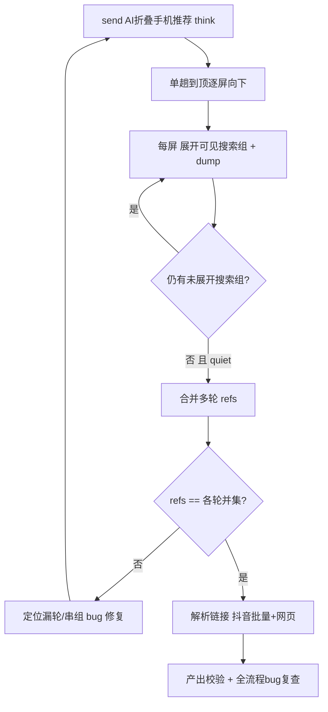

# 多轮联网搜索：完整展开抓取验证与修复

## 策略
测试驱动：先实测看真实轮数与 UI，再按暴露的 bug 定向修（不预先大改）。

## 一、实测观察（think 模式更易触发多轮）
入口 [run_qa_capture.py](run_qa_capture.py)
- 跑 `--prompt "AI折叠手机推荐" --mode think`，静默观察日志中 `已展开搜索组` / `已展开 fast 模式引用头` 次数与标题。
- 产出目录逐个 `expand_XX.xml` dump：统计 `search_reference_title` / 含「搜索…篇资料」的组数量 = 联网搜索轮数；核对 `thinking_references.json` 覆盖是否等于各轮引用之和。
- 判定标准：轮数 = N（每轮多链接），最终 refs 数量 == 各轮可见条目并集，无漏轮、无串组。

## 二、按实测定向修复（候选隐患，命中才改）
文件 [app/modules/qa_capture.py](app/modules/qa_capture.py)、[app/modules/qa_hierarchy.py](app/modules/qa_hierarchy.py)
- 轮识别过窄：`_is_search_group_title`(442) 仅认「搜索+篇资料」。若某轮文案不同（如「联网搜索」无「篇资料」）→ 放宽识别关键词。
- 同标题不展开：`_expand_visible_search_groups`(506) 用 `expanded_titles` 按标题去重，两轮标题相同则漏展开 → 改用「标题+容器 bounds/序号」做键，或按「是否已有可见子条目」判断而非标题。
- 提前触底：`_sweep_expand_and_capture`(595) quiet-frame 达标即停，下方未展开轮会漏 → 触底前确认无未展开搜索组容器，否则继续下探。
- 跨轮串组/漏计：`_merge_thinking_panels`(674) 与 `parse_thinking_panel`(533) 按 `group` 归类，空/重名 group 会串 → 归属用容器 bounds 区间而非仅 y 就近；合并去重键补 group 消歧。

## 三、素材兜底（无多轮时换词直到成功）
- 备选提示词（递进更易触发多轮联网检索）：
  - 「2026年AI大模型手机推荐，要有最新参数对比」
  - 「对比华为Mate X7和荣耀MagicV6，联网查最新评测」
  - 「折叠屏手机销量排行榜2026最新数据」
- 每换一次记录是否出现「已搜索…篇资料」多轮面板。

## 四、每轮全流程 bug 复查
每次测试后检查并修：正文完整性、thinking.md 多轮结构、引用去重、URL 解析（抖音批量+网页逐条）、截图拼接、返回聊天页是否干净。

## 数据流
