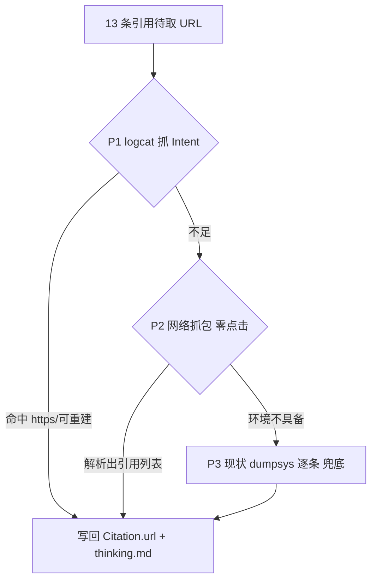

# 思考引用真链接：高效低成本抓取（按优先级实现）

目标：把每条蓝色引用的**真实 HTTP 链接**拿全，且比现状（逐条点击 + `dumpsys` + 多次 `back`，约 15s/条）更快更省。现状已能拿 11/13（[app/modules/qa_reference_urls.py](app/modules/qa_reference_urls.py)），作为**保底**保留。

## 已知事实（来自现有代码与前次真机侦察）
- 引用点击后：抖音类进 `com.ss.android.ugc.aweme/.detail.ui.DetailActivity`，Intent 为 `dat=snssdk1128://detail ... (has extras)`；真 https 在 **extras 的 `link_url=`**（`dumpsys` 可见）。
- `doc_id == 抖音视频 id`，即 `https://www.iesdouyin.com/share/video/<doc_id>`；网页类（如京东）`link_url=` 直接是 https。
- 现成工具：logcat 助手 [capture/utils/capture_logcat.py](capture/utils/capture_logcat.py)（`clear_logcat`/`dump_logcat_once`，支持 events/main buffer）；豆包定制的 mitm+Frida 脱壳栈 [run_capture.py](run_capture.py) + [capture/scripts/httptoolkit_intercept/](capture/scripts/httptoolkit_intercept/)（`light_plus` 已能解密豆包 TLS）。

## Phase 0 — logcat 侦察（先验证再写码，~2 分钟）
在已加载引用的答案页，对**1 条抖音 + 1 条网页**引用：`adb logcat -c` → 点击 → `adb logcat -d -b events -b main`。用已知视频 id / `https` / `snssdk1128` / `link_url` 反查命中在哪个 buffer/行，判定 logcat 能否稳定给出 url（或 `snssdk1128://...` + id 供重建）。据此决定 P1 是否成立。

## Phase 1 — logcat 快速解析器（优先，复用现有助手）
- 新增 `_resolve_via_logcat()`（放入 [app/modules/qa_reference_urls.py](app/modules/qa_reference_urls.py)）：对每条引用 `clear_logcat` → 点击（**不等页面加载**）→ `dump_logcat_once`（events+main）→ 正则抽 `dat=https?://…` / `link_url=…` / `snssdk1128://…?…<id>`；抖音用 id 重建 `iesdouyin` 分享链 → `safe_back_to_chat`。
- 去掉当前 3.5s 固定等待，改为“点击后轮询 logcat 至命中或短超时（~1.2s）”，显著提速。
- `resolve_thinking_reference_urls()` 增 `method="logcat"|"dumpsys"|"auto"`；`auto` 先 logcat，未命中当条回落 dumpsys。默认 `auto`。

## Phase 2 — 零点击网络抓包（P1 不足或追求“不打开链接”时）
- 复用 [run_capture.py](run_capture.py) 的 `capture-start` + `frida`（`light_plus`）拉起解密通道。
- 新增一个 mitmproxy addon 脚本（`capture/addons/qa_reference_dump.py`，`mitmdump -s` 加载）：过滤豆包业务域响应体，落盘 JSON；定位含**引用标题 + url/doc_id** 的补全/搜索接口。
- 新增解析器 `app/modules/qa_reference_net.py`：从抓到的响应提取 `[{title, url, doc_id, source}]`，按标题与 `thinking_references` 对齐写回 `url`。**一次答案一次抓取，O(1) 无逐条点击**。
- 与 `qa_capture` 集成：`--resolve-method net` 时走此路；抖音仅有 `doc_id` 则用 `iesdouyin/share/video/<doc_id>` 重建。

## Phase 3 — 保底
保留现有 `dumpsys` 逐条解析（已加可见性滚动 + 重试），当 P1/P2 不可用（如云机未装 Gadget 版豆包）时自动使用，确保始终有结果。

## 集成与产出
- `run()`（[app/modules/qa_capture.py](app/modules/qa_capture.py)）与 `run_qa_capture.py` 增 `--resolve-method {auto,logcat,net,dumpsys}`（默认 `auto`=先 logcat 再 dumpsys）。
- 三条路径都写回 `Citation.url`，并经 `_sync_urls_to_panel` 刷新 `thinking.md` / `thinking_references.json`。
- 单测：扩 [tests/test_qa_reference_urls.py](tests/test_qa_reference_urls.py) 覆盖 logcat 行解析（`dat=`、`link_url=`、`snssdk1128://` → 重建 iesdouyin）与 net 响应 JSON→引用对齐；均用样本文本，无需真机。
- 真机验收：`python run_qa_capture.py -s 46H0219118001437 --mode fast --skip-send`，目标 13/13 且总耗时明显低于现状。

## 取舍说明
- P1 最轻量、复用最多、仍需点击但去掉长等待，通常够快；抖音若 logcat 只给 `snssdk1128` scheme，用 id 重建即可。
- P2 最高效（零点击、一次拿全，且带 title/source/doc_id 元数据），但依赖 Gadget 版豆包 + mitm 在该（云）机可用；作为 P1 不足时的进阶路径。
- P3 保证不空手而归。