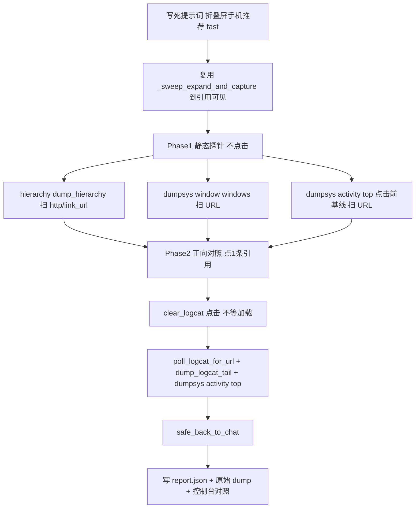

## Static URL Probe 实验

### 目标
验证上一轮结论：豆包思考引用**静态 dump 拿不到 URL**，URL 只在**点击后**的 logcat/dumpsys 里出现。产出可复现的对照数据，不改动任何业务模块。

### 新增单文件（复用为主，不改现有代码）
新增 `run_qa_static_url_probe.py`（放仓库根，与 [run_qa_capture.py](run_qa_capture.py)、[run_qa_spot_check.py](run_qa_spot_check.py) 同级）。写死提示词、mode=fast，全部逻辑复用现有类与函数。

### 复用清单（直接调用，不复制实现）
- 启动/设备：抄 [run_qa_capture.py](run_qa_capture.py) 94-98 的 `DeviceManager` / `load_profile` / `DoubaoQaCapture(device, profile=...)`。
- 走到「引用可见」：依次调用 `DoubaoQaCapture` 的
  - `self._crawler.start_app()` / `self._crawler.handle_login_if_needed(...)`
  - `_open_new_conversation()`(286) → `_select_mode("fast")`(339) → `self._crawler.send_message(prompt)` → `self._crawler.wait_reply_done(180)`
  - `_ensure_chat()`(112) / `_dismiss_overlays()`(270)
  - `_sweep_expand_and_capture(session_dir)`(747) → 返回 `thinking_panel`（引用**有标题、无 url**，正是待验证项）
- URL 正则/解析：从 [app/modules/qa_reference_urls.py](app/modules/qa_reference_urls.py) 复用 `extract_urls_from_dumpsys_text`、`_device_serial`、`_ensure_citation_visible`(1137)、`_click_citation`(1005)、`poll_logcat_for_url`(811)、`resolve_url_via_dumpsys`(845)。
- logcat：从 [capture/utils/capture_logcat.py](capture/utils/capture_logcat.py) 复用 `clear_logcat`(56)、`dump_logcat_tail`(195)。
- 回聊天页：`Navigator(...).safe_back_to_chat()`（[app/modules/navigator.py](app/modules/navigator.py) 170）。

### 三段实验流程

- Phase 1 静态（零点击）：
  - hierarchy：`self.d.dump_hierarchy(compressed=False)`（等价 `adb shell uiautomator dump`），统计 `tv_reference_content` 节点数 = 引用数，`extract_urls_from_dumpsys_text` 命中数（预期与引用无关，≈0）。
  - `adb -s <serial> shell dumpsys window windows`：扫 `http/link_url/snssdk`（预期 0）。
  - `adb -s <serial> shell dumpsys activity top`：点击前基线，扫引用 URL（预期 0）。
- Phase 2 正向对照（点第 1 条引用）：`_ensure_citation_visible` → `clear_logcat` → `_click_citation`（不等加载）→ `poll_logcat_for_url` + `dump_logcat_tail` + `dumpsys activity top` → 抽到 `link_url=`/`snssdk1128://`（预期命中）→ `safe_back_to_chat`。

### 产出
- 目录 `logs/qa_static_url_probe/<日期>/<时刻>/`：`hierarchy.xml`、`dumpsys_window.txt`、`dumpsys_activity_pre.txt`、`logcat_post_click.txt`、`dumpsys_activity_post.txt`、`report.json`。
- `report.json` 字段：`ref_count`、`static_hierarchy_url_hits`、`dumpsys_window_url_hits`、`dumpsys_activity_pre_url_hits`、`post_click_url`(点击后拿到的真链)、`clicked_ref_title`。
- 控制台对照表：静态三项 URL 命中（预期 0）vs 点击后命中（预期 1，附 URL），一眼得出结论。

### 运行
`python run_qa_static_url_probe.py`（可选 `-s <serial>`）。纯只读探针 + 单次点击后自动返回，不写业务产出、不改任何模块。

### 取舍
- 只新增一个入口脚本，全部逻辑复用现有函数，风险最小、可删除。
- 单次点击仅作正向对照，用完 `safe_back_to_chat` 回到聊天页，不影响后续。