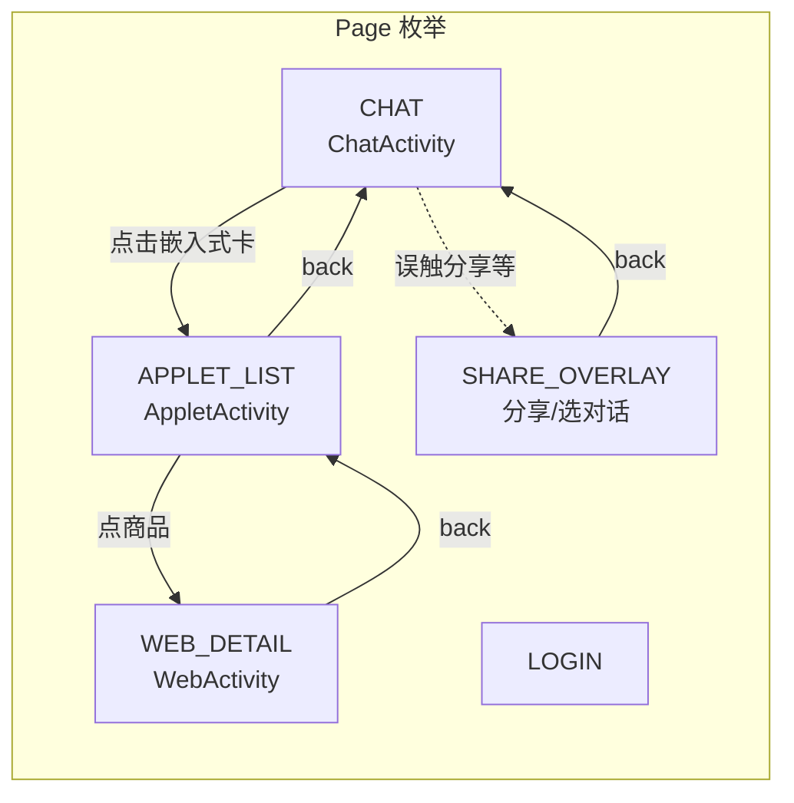
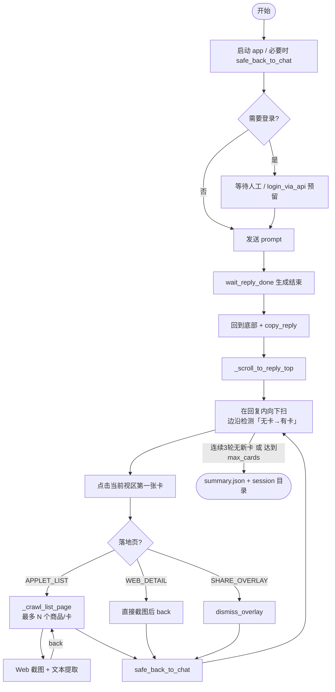
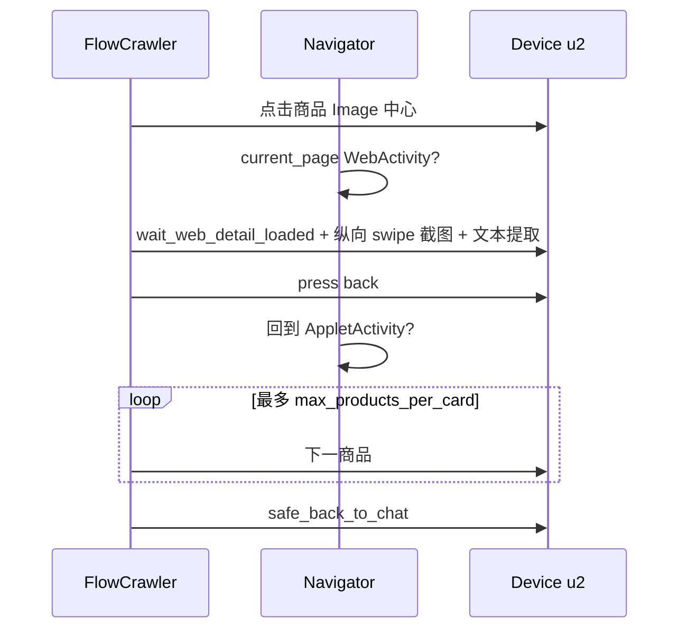

# 豆包商品爬虫（doubao-app-spider）

基于 **uiautomator2** 在真机上驱动豆包（`com.larus.nova`）：发送提示词、等待 AI 回复、从聊天里的嵌入式商品入口进入 **小程序列表（AppletActivity）** 与 **商品详情（WebActivity）**，落盘多屏截图、页面文本与汇总 JSON。不依赖网络抓包（豆包有 SSL pinning / TTNet），纯 UI 自动化。

---

## 快速开始

| 前提 | 说明 |
|------|------|
| Python | 3.10+ 推荐；使用 **venv** |
| 设备 | USB 调试开启，`adb devices` 为 `device` |
| 豆包 | 已安装且可登录 |

```bash
cd doubao-app-spider
python3 -m venv .venv
source .venv/bin/activate
pip install -r requirements.txt

# 确认设备
adb devices

# 运行爬虫
python run_flow_crawl.py
python run_flow_crawl.py --skip-send                        # 会话已有回复时
python run_flow_crawl.py --prompt "推荐一款拍照最好的手机"    # 自定义提示词
python run_flow_crawl.py --max-cards 3                       # 最多 3 张卡片
python run_flow_crawl.py --max-products-per-card 3           # 每张卡片最多 3 个详情
python run_flow_crawl.py -s <adb_serial>                     # 多设备时指定序列号
python run_flow_crawl.py --device-profile <name>             # 手动指定设备 profile（一般自动识别）
```

---

## 爬虫全流程

### 1. Activity 与页面语义（Navigator）

`app/modules/navigator.py` 把当前界面归类为 `Page`，用于安全 `back` 与恢复。



### 2. 主流程：`run_flow_crawl.py`（FlowCrawler）

```
1. 启动豆包 APP
2. 登录检测（已登录则跳过）
3. 输入提示词 → 发送 → 等待回复完成
4. 回到底部 → 复制回复正文
5. 滚到回复顶部 → 向下扫描嵌入式商品卡片
6. 每张卡片：点击 → 进入 AppletActivity 商品列表
   6.1 列表内收集商品项（首屏）
   6.2 逐个点击 → 进入 WebActivity 商品详情
       - 多屏截图（最多 12 屏）
       - 提取页面文本 → detail_text.txt
       - back 回列表
   6.3 列表处理完 → back 回聊天页
7. 继续向下扫描下一张卡片
8. 保存 summary.json → 结束
```



### 3. 单张卡内：列表与详情循环



### 4. 卡片扫描退出机制

| 条件 | 说明 |
|------|------|
| 连续 3 轮无新卡片 | `no_card_streak >= 3` 则 break |
| 达到 `--max-cards` | 默认 10，可调 |
| 循环硬上限 40 轮 | 兜底保护 |
| bounds 模糊去重 | 同一卡片 y 偏移 <=40px 视为已点过，不会重复进入 |

---

## 产出目录

每次运行生成 `logs/crawl_<YYYYMMDD_HHMMSS>/`：

```
logs/crawl_20260324_190823/
├── reply.txt                           # AI 回复正文
├── summary.json                        # 汇总（卡片数、商品数、截图路径）
├── vivo_X300_Pro_5G智能手机/            # 卡片 1 的 Applet 标题
│   ├── 旗舰新品_vivo_X300_Pro/         # 商品 1
│   │   ├── detail_01.png ~ detail_12.png
│   │   └── detail_text.txt             # 提取的页面文本
│   ├── 地方补贴10_vivo_X300_Pro/       # 商品 2
│   │   └── ...
│   └── ...
└── card_2/                             # 卡片 2（标题为空时用序号）
    └── ...
```

---

## 项目结构

```
doubao-app-spider/
├── README.md                      # 本文件
├── run_flow_crawl.py              # 唯一入口脚本
├── run_capture.py                 # 逆向抓包工具（Frida/mitmproxy，备用）
├── app/
│   ├── config/
│   │   ├── config.py              # 包名、Activity、路径等基础配置
│   │   ├── gesture_profile.py     # GestureProfile dataclass（108 个手势/几何参数）
│   │   ├── profile_loader.py      # JSON profile 加载器（自动识别设备品牌型号）
│   │   └── profiles/              # 设备 profile JSON 文件
│   │       ├── default.json
│   │       ├── honor_pct_al10.json
│   │       └── huawei_example.json
│   ├── modules/
│   │   ├── flow_crawler.py        # FlowCrawler：全流程编排（核心）
│   │   ├── navigator.py           # Navigator + Page 枚举：页面识别与跳转
│   │   └── chat_ui_heuristics.py  # 聊天区元素检测（复制按钮、内容区边界等）
│   └── utils/
│       ├── device.py              # DeviceManager：u2 设备连接封装
│       ├── utils.py               # 日志、目录创建等通用工具
│       └── step_journal.py        # 步骤执行记录
├── capture/                       # 逆向辅助（Frida Gadget / mitmproxy / APK patch）
├── recon/                         # 侦察工具
│   ├── apk_decompile.py           # jadx 反编译 APK 生成结构报告
│   ├── ui_spy.py                  # 真机 UI 变化 JSONL 记录器
│   └── flow_recorder/             # 操作流程录制器（录制样本供开发参考）
├── doc/                           # 专题文档
├── logs/                          # 运行产出
└── requirements.txt
```

---

## 核心模块

### FlowCrawler (`app/modules/flow_crawler.py`)

全流程编排器。关键方法：

| 方法 | 作用 |
|------|------|
| `start_app()` | 启动豆包，处理遗留页面，回到聊天页 |
| `send_message(text)` | 定位输入框、输入、发送 |
| `wait_reply_done(timeout)` | 「停止」按钮消失 + 正文连续稳定 3 轮 = 完成 |
| `copy_reply()` | 优先点 `msg_action_copy`，失败取最长文本候选 |
| `find_embedded_product_cards()` | 扫描无 rid 的 FrameLayout 卡片占位 |
| `_crawl_list_page(dir, max, result)` | AppletActivity 内遍历商品，逐个进详情 |
| `_capture_detail(dir, index)` | 多屏截图 + dump_hierarchy 提取文本 |
| `run(prompt, skip_send, ...)` | 主入口，返回 result dict |

### Navigator (`app/modules/navigator.py`)

基于 Activity + resource-id 判断页面：

| Page | Activity | 说明 |
|------|----------|------|
| `CHAT` | `ChatActivity` | 聊天主页 |
| `APPLET_LIST` | `AppletActivity` | 商品列表（WebView） |
| `WEB_DETAIL` | `WebActivity` | 商品详情 H5 |
| `SHARE_OVERLAY` | （覆盖层） | 分享面板/对话选择弹窗 |
| `LOGIN` | `AccountLogin` 等 | 登录页 |

关键方法：`current_page()`, `safe_back_to_chat()`, `dismiss_overlay()`, `wait_web_detail_loaded()`

### chat_ui_heuristics (`app/modules/chat_ui_heuristics.py`)

聊天区布局检测（`splitter` / `message_list_parent` 等 resource-id 定位内容区边界）。

| 函数 | 作用 |
|------|------|
| `display_wh(device)` | 获取屏幕宽高 |
| `content_top_y / content_bottom_y` | 消息区上下边界 |
| `try_click_copy_button(device)` | 点击 `msg_action_copy` |
| `collect_reply_text_candidates` | 收集疑似 AI 回复的长文本 |

---

## 设备 Profile（多设备支持）

手势参数集中在 `GestureProfile` dataclass（108 个字段），通过 JSON 文件按设备覆盖。

**自动识别**：连接设备后读取 `ro.product.brand` + `ro.product.model`，拼成 key（如 `honor_pct_al10`），自动加载对应 JSON。

**新建 profile**：
```bash
adb shell getprop ro.product.brand   # 如 HONOR
adb shell getprop ro.product.model   # 如 PCT-AL10

# 创建 profile（只需覆盖与默认不同的字段）
cat > app/config/profiles/honor_pct_al10.json << 'EOF'
{
  "safe_swipe_x_ratio": 0.22,
  "slow_scroll_duration": 0.40
}
EOF
```

---

## 侦察工具（recon/）

反编译默认读取仓库根目录的 `doubao_original.apk`（需自行下载官方包放到本地，**不要 `git add` APK**，已列入 `.gitignore`）。

| 工具 | 用途 |
|------|------|
| `recon/apk_decompile.py` | jadx 反编译 APK，生成 Activity/layout/strings 报告 |
| `recon/ui_spy.py` | 真机 UI 变化实时记录（JSONL + 截图） |
| `recon/flow_recorder/` | 操作流程录制器，录制完整操作样本供对照开发 |

---

## 已知限制

1. **嵌入式卡片识别是启发式的**：依赖无 rid 的 FrameLayout 宽高比，不同豆包版本可能需调阈值。
2. **商品详情是 H5 WebView**：文本通过 dump_hierarchy 获取；图片只能截图，无法拿到原始 URL。
3. **登录需人工**：`login_via_api` 已预留接口，对接测试号 API 后可全自动。
4. **Applet 列表依赖 WebView 内控件**：店铺活动页变化时可能需调 `_collect_applet_items` 阈值。

## 常见问题

| 问题 | 解决 |
|------|------|
| `adb devices` 为空 | 检查 USB 线（需数据线）、USB 模式改文件传输、手机授权调试 |
| `SecurityException: INJECT_EVENTS` | u2 agent 失效，重启 `python -m uiautomator2 init` |
| 复制按钮未找到 | 确认回复已完成、操作栏可见；检查 `msg_action_copy` rid |
| 卡片重复识别 | 调大 `_bounds_near` 容差（默认 40px）或降低 `--max-cards` |
| 详情页截图中断 | 检查 `navigator.is_web_detail()` 是否匹配当前 Activity |
| `push` 提示 APK 超过 100MB | 勿提交 `*.apk`；已从跟踪移除的需改写历史（如 `git commit --amend`）后再推送 |

---

## Cursor 规则

`.cursor/rules/` 下的 `.mdc` 文件在编辑时自动加载：业务问题先查 `doc/` 与代码（`business-context.mdc`）、豆包 UI 约定（`doubao-spider.mdc`）、代码风格（`code-style.mdc`）等。

## 相关文档

| 文档 | 内容 |
|------|------|
| [`doc/spot_check_projects.md`](doc/spot_check_projects.md) | 签单抽检：vivo-x-fold6 / 雅诗兰黛 多机启动、换机同步、规范 |
| [`doc/qa_capture.md`](doc/qa_capture.md) | QA 问答采集、抽检 CSV、无人值守 |
| [`doc/real_flow_analysis.md`](doc/real_flow_analysis.md) | 真实流程分析、Activity、rid、产出与限制 |
| [`doc/capture_frida_gadget.md`](doc/capture_frida_gadget.md) | Frida Gadget + mitmproxy 抓包步骤 |
| [`doc/capture_observed_traffic.md`](doc/capture_observed_traffic.md) | 抓包中常见非业务请求备忘 |
