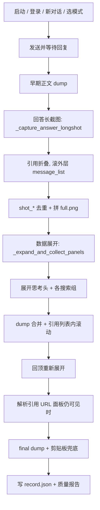

# 豆包问答完整采集（qa_capture）

独立于电商详情爬虫 `run_flow_crawl.py`，仅归档**一次问答 exchange**。

## 黄金路径（已验证，Honor PCT-AL10）

参考样本：`logs/qa_capture/2026-07-10/145156/`（14/14 引用 URL，6 屏截图）

```bash
# 1. 设备环境（新手机首次）
./scripts/setup_device.sh

# 2. 推荐命令（fast 模式 + 联网搜索类提示词）
python run_qa_capture.py --prompt "折叠屏手机推荐" --mode fast

# 3. 严格质量门禁（未达标 exit 2）
python run_qa_capture.py --prompt "折叠屏手机推荐" --mode fast --strict
```

| 项 | 推荐 | 说明 |
|----|------|------|
| 模式 | **`fast`** | 思考/引用面板同样会出现；`think` 模式切换不稳定且 URL 解析易失败 |
| 提示词 | 触发联网搜索的选购类问题 | 如「折叠屏手机推荐」 |
| URL | 默认 `logcat` | logcat 常驻流 → 抖音批量 → 逐条点击（未命中可 `--resolve-method auto` 加 dumpsys） |
| 质量 | `--strict` | 正文 / 思考 / 引用 / 全量 URL / 截图 / 长图 六项 |

多轮联网搜索验证可用 `--mode think` + 对比类长提示词，但 URL 解析仍在优化中，**生产采集优先走 fast 黄金路径**。

## 入口

```bash
python run_qa_capture.py
python run_qa_capture.py --prompt "你的问题"
python run_qa_capture.py --mode fast           # 推荐（默认）
python run_qa_capture.py --mode think          # 多轮思考验证用
python run_qa_capture.py --skip-send           # 当前屏已有回复
python run_qa_capture.py --resolve-method logcat   # 快速 logcat（默认）
python run_qa_capture.py --resolve-method auto     # logcat 未命中再 dumpsys
python run_qa_capture.py --resolve-method net    # mitm 零点击（需先启 mitm addon）
python run_qa_capture.py --no-resolve-urls       # 不解析 URL
python run_qa_capture.py --strict              # 质量未达标时 exit 2
python run_qa_capture.py -s <adb_serial>
```

## 流程（单趟 sweep，2026-07 固化版）



1. 启动豆包 → 登录 → 创建新对话 → 切换模式（fast 推荐）
2. 发送提示词 → 等待回复完成 → **早期正文**采集
3. **回答长截图** `_capture_answer_longshot`：引用保持折叠，滚外层 `message_list` 多帧截图 → 拼 `full.png`
4. **数据展开** `_expand_and_collect_panels`：展开搜索组、引用列表内滚动、hierarchy dump 合并（供 URL/思考结构化）
5. sweep 结束**回顶重新展开**，在思考面板仍可见时 **解析引用 URL**
6. final hierarchy + 剪贴板取正文 → 写入产出目录
7. 终端打印 `[质量]` 六项校验（`app/modules/qa_quality.py`）

## 产出目录

```
logs/qa_capture/2026-07-10/145156/
```

多项目时增加一层项目目录：

```
var/雅诗兰黛/qa_capture/2026-07-14/120830/
├── record.json
├── question.txt
├── thinking.md              # 结构化思考过程 + 各搜索组引用（含 URL）
├── thinking.txt
├── answer.txt
├── citations.json
├── thinking_references.json # 含 group / url
├── raw_texts.json
├── hierarchy_expand_01.xml …
├── shot_01.png … shot_NN.png
├── full.png
└── screen_final.png
```

## 质量校验（固化）

代码：`app/modules/qa_quality.py`，采集结束自动打印：

| 检查项 | 标准 |
|--------|------|
| 正文 | ≥ 80 字 |
| 思考 markdown | 非空 |
| 思考引用 | ≥ 1 条（无联网引用时记 0 条并仍可通过） |
| 引用 URL | 全量有 url（`--strict` 硬性要求；无引用时 N/A） |
| 分屏截图 | ≥ 1 张 |
| 拼接长图 | `full.png` 存在 |

单元测试：`tests/test_qa_quality.py`（绑定黄金样本 `145156`）

## record.json 字段

| 字段 | 说明 |
|------|------|
| `mode` | `fast`（推荐）/ `think` |
| `thinking` | `thinking.md` 全文（markdown） |
| `thinking_references[]` | `ref_index` / `title` / `source` / `url` / **`group`** |
| `screenshots[]` | 去重后的分屏截图 |
| `stitched_screenshot` | `full.png` |

## 引用 URL 解析（`--resolve-method`）

| 方式 | 说明 |
|------|------|
| `logcat`（默认） | 常驻 logcat 流 → 抖音批量 aweme id → 逐条点击抓 Intent（不等页面加载） |
| `auto` | logcat 优先，非抖音引用未命中时回落 dumpsys |
| `dumpsys` | 仅 dumpsys |
| `net` | mitm 零点击，未覆盖再回落 `auto` |

准备阶段：`prepare_citations_for_url_resolve` 在 `search_reference_list` 内轻量滚动 + hierarchy 批量刷新 bounds（避免逐条长滑卡屏）。

mitm 零点击：

```bash
mitmdump -s capture/addons/qa_reference_dump.py --set qa_ref_dump_dir=logs/qa_capture_net
python run_qa_capture.py --resolve-method net --net-dump-dir logs/qa_capture_net
```

## thinking.md 结构示例

```markdown
## 搜索 3 个关键词，参考 15 篇资料

### 思考过程
…

### 搜索 3 个关键词，参考 15 篇资料

**搜索关键词：** “…”

**参考资料：**

1. 标题一 — https://www.iesdouyin.com/share/video/…
2. 标题二（IT之家） — http://…
```

## 选择器（Honor PCT-AL10）

| 用途 | 选择器 |
|------|--------|
| 思考头 | `ll_reference_title` / `tv_reference_title` |
| 搜索组 | `searchReferenceTitleContainer` |
| 引用列表 | `search_reference_list` 或 fast 内联 `sub_keyword_reference` + `RecyclerView` |
| 引用条目 | `tv_reference_content` / `tv_reference_index` / `ll_source_item` |
| 关键词 | `search_key_words` / `sub_keyword_reference` |

> **换机注意**：豆包 UI 的 resource-id 通常跨机型一致，但**布局容器**可能不同（think 面板用 `search_reference_list`，fast 内联用 `sub_keyword_reference`）。差异主要在分辨率、状态栏高度、滚动惯性——用 **profile JSON** 调，不要改业务代码里的硬编码像素。

## 换机 / 新型号适配（沿用 flow_crawl 做法）

与 `run_flow_crawl.py` 相同：**比例参数进 `GestureProfile`，机型差异进 `app/config/profiles/<brand_model>.json`**，启动时 `load_profile(device=...)` 自动匹配。

```bash
# 查看识别出的 profile key（brand_model 小写下划线）
adb shell getprop ro.product.brand; adb shell getprop ro.product.model

# 自动匹配 profiles/honor_pct_al10.json 等；无文件则用 default.json
python run_qa_capture.py --prompt "折叠屏手机推荐" --mode fast

# 手动指定（抽检机、折叠屏内屏分辨率特殊时）
python run_qa_capture.py --device-profile vivo_x_fold6 --prompt "..."
```

**新型号 SOP**（对齐 `doc/ui_dump_to_implementation.md`）：

1. `./scripts/setup_device.sh` + 跑一次黄金路径看日志里 `📱 自动匹配设备 profile: xxx`
2. 若无匹配 → 复制 `honor_pct_al10.json` 为 `profiles/<auto_key>.json`
3. `recon/flow_recorder/recorder.py` 录一条「展开思考引用」→ 确认引用列表容器顺序
4. 只改 JSON 里与 default 不同的字段，优先调：
   - `qa_ref_list_probe_xpaths` — 引用列表 xpath 探测顺序
   - `qa_resolve_viewport_y0/y1` — URL 点击时「可见」垂直 band
   - `qa_shot_*` / `qa_scroll_top_*` — 长截图与到顶滚动
   - `qa_expand_group_click_sleep` — 展开搜索组后等待
5. `--strict` 跑通后再上批量抽检

| 层级 | 放什么 | 不放什么 |
|------|--------|----------|
| `qa_hierarchy.py` | 稳定 `resource-id`、解析逻辑 | 像素坐标、机型名 |
| `profiles/*.json` | 比例、超时、容器探测顺序 | XPath 业务分支 if/else |
| 真机侦察 `logs/recon*.xml` | 选择器来源凭证 | — |

## 与电商爬虫区别

| | `run_flow_crawl.py` | `run_qa_capture.py` |
|--|---------------------|---------------------|
| 目标 | 商品卡 → 详情截图 | 完整问答归档 |
| 产出 | `crawl_*` | `qa_capture/<日期>/<时刻>/` |

## 抽检明细批量采集（APP → CSV）

基于签单提示词 CSV，逐条调用 QA 采集并写入本地抽检明细 CSV（29 列，对齐业务 xlsx schema）。

```bash
# 试点 10 条（跨意图抽样）
python run_qa_spot_check.py \
  --prompts-csv var/vivo-x-fold6/签单提示词导出_20260710_183049.csv \
  --out-csv var/vivo-x-fold6/抽检明细_20260710_APP采集.csv \
  --pilot 10 --mode fast --strict

# 全量续跑（跳过 CSV 中已有 关键词编号）
python run_qa_spot_check.py --resume --strict

# 雅诗兰黛（xlsx 签单 + 项目隔离目录）
python run_qa_spot_check.py \\
  --prompts-file var/雅诗兰黛/签单提示词导出_20260714_000454.xlsx \\
  --out-csv var/雅诗兰黛/抽检明细_20260714_APP采集.csv \\
  --state-file var/雅诗兰黛/spot_check_state.json \\
  --project 雅诗兰黛 \\
  --resume --mode fast

# 清理引用/URL 不达标行后全量续跑（logs 会话保留）
python run_qa_spot_check.py --purge-incomplete --resume --strict --allow-partial-douyin-urls
```

| 项 | 值 | 说明 |
|----|-----|------|
| 输入 | 签单提示词 CSV | 提示词 + 意图编号/名称/词包等绑定字段 |
| 产出 CSV | `var/vivo-x-fold6/抽检明细_*_APP采集.csv` | 每提示词一行 |
| 平台 | `DB` / `豆包` / `APP` | 与参考 xlsx 的 DS/PC 区分，反映真机采集来源 |
| 断点 | `spot_check_state.json` | 已完成关键词编号与 session_dir |
| 失败 | `spot_check_failures.jsonl` | 质量不达标或采集失败，不写入 CSV |
| 抖音 URL | 默认 `--allow-partial-douyin-urls` | 批量解析后跳过逐条点击，避免卡抖音 feed |

映射逻辑：`app/modules/qa_spot_check_export.py`（意图字段仅来自签单 CSV，不从采集结果推断）。

## 节点树精准点击探针

避免坐标点击不稳定：列表内滚到 xpath 命中 → 校验 rid/序号/标题 → `element.click()`。

```bash
# 当前屏已展开引用：只定位不点击
python run_qa_node_click_probe.py --mode citations --dry-run

# 真正点击（可加 --resolve-urls 解析真链）
python run_qa_node_click_probe.py --mode citations --max-refs 8 --resolve-urls

# 商品卡/Applet 列表：按 bounds 反查可点节点（禁止 d.click(x,y)）
python run_qa_node_click_probe.py --mode products --dry-run
```

| 模块 | 作用 |
|------|------|
| `app/modules/ui_node_click.py` | 滚到节点、bounds→节点、row_index_only 二次确认 |
| `run_qa_node_click_probe.py` | 真机探针，产出 `logs/qa_node_click/.../report.json` |

引用解析主路径 `qa_reference_urls` 已接入：序号滚入 DOM + `row_index_only` 可见行标题确认。

单元测试：`tests/test_qa_spot_check_export.py`
