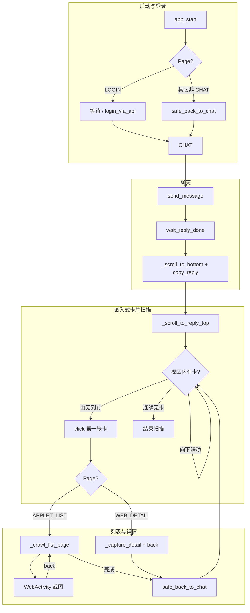
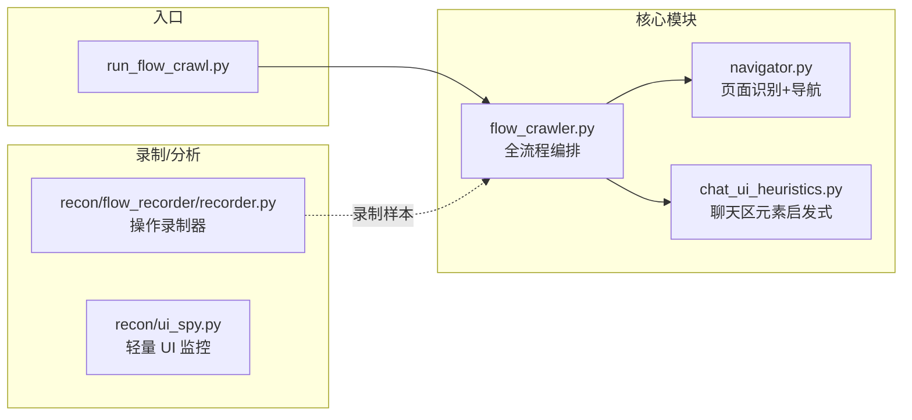

# 真实操作流程分析与爬虫架构

> 初版数据来源：`recon/flow_recorder` 会话录制（Activity、XML、推断操作）。下文与 **当前代码**（`FlowCrawler.run`）对齐。

## 当前端到端流程（代码步骤）

与 `app/modules/flow_crawler.py` 中 `FlowCrawler.run` 一致：

1. **启动**：`app_start(com.larus.nova)`；若当前在 Applet / Web / 分享覆盖层，则 `Navigator.safe_back_to_chat()` 回到聊天。
2. **登录**：`handle_login_if_needed` — 非登录页直接通过；否则等待人工登录，或传入 `phone`+`code` 走预留的 `login_via_api`。
3. **提问**：`send_message` → `wait_reply_done`（存在「停止」视为仍在生成；消失后正文连续稳定若干轮视为完成）。
4. **复制**：`_scroll_to_bottom` → `copy_reply`（优先点击 `msg_action_copy`；失败则取 `collect_reply_text_candidates` 中最长段，降低误把短建议当正文）。
5. **嵌入式商品卡片**：`_scroll_to_reply_top`（先到底部再向上滑，避免长回复里卡片在条目中上部时永远不出屏）→ 在聊天内 **向下轻扫**，用 **可见性边沿** 状态机：从「当前视区无卡」到「有卡」记为新卡片，点击 `find_embedded_product_cards` 返回的 **第一张** → 进列表或直达 Web。
6. **列表与详情**：在 `AppletActivity` 内 `_collect_applet_items`（可点 Image + 关联标题去重）→ `_crawl_list_page` 逐个进 `WebActivity`，`_capture_detail` 多屏截图 → `back` 回列表；满 `max_products_per_card` 或异常退出列表循环后 `safe_back_to_chat`，继续扫下一张卡。
7. **汇总**：`session_dir/summary.json` + 控制台统计。

## 代码文件结构

| 文件 | 作用 |
|------|------|
| `run_flow_crawl.py` | CLI：`--prompt`、`--skip-send`、`--max-products-per-card`、`-s` 设备号 |
| `app/modules/flow_crawler.py` | `FlowCrawler`：上述 1–7 步、产出目录、嵌入式卡启发式 |
| `app/modules/navigator.py` | `Page` 枚举、Activity 匹配、分享层检测、`safe_back_to_chat`、`wait_web_detail_loaded` |
| `app/modules/chat_ui_heuristics.py` | `splitter` / `message_list_parent` 等内容区边界、回复候选、`msg_action_copy` |
| `recon/flow_recorder/recorder.py` | 常驻录制：dump、截图、操作推断，供对照 UI 改选择器 |

## 产出目录约定

每次运行生成 `logs/crawl_<YYYYMMDD_HHMMSS>/`：

| 路径 | 含义 |
|------|------|
| `reply.txt` | 本次复制的 AI 正文（若有） |
| `summary.json` | `embedded_cards_count`、`cards[]`、`products_captured`、`details` 等 |
| `<Applet 顶栏标题或 card_N>/` | 单张嵌入式卡片对应的一次列表会话 |
| `<Applet 子目录>/<商品标题>/detail_XX.png` | 该商品详情纵向多屏截图 |

`embedded_cards_count` 来自扫描状态机触发的次数，**不等于** `find_embedded_product_cards` 在某一帧里的个数；若启发式误检或漏检，需对照真机 XML 调 `find_embedded_product_cards` 阈值。

## 各页面关键元素

### ChatActivity (`com.larus.bmhome.chat.ChatActivity`)

| 元素 | resource-id | 说明 |
|------|-------------|------|
| 消息列表 | `message_list` (RecyclerView) | 与 `message_list_parent` 配合 |
| 消息区分界 | `splitter` | 内容区与输入区边界，`content_bottom_y` 优先使用 |
| AI 回复正文 | 多无 rid，`TextView` | `collect_reply_text_candidates` 过滤短文本与已知 UI |
| 复制按钮 | `msg_action_copy` | `try_click_copy_button` |
| 收藏 / 分享 | `msg_action_single_collect` / `msg_action_share` | 勿与「回到底部」等宽泛文案混用 |
| 输入框 | `input_text` | `send_message` |
| 发送按钮 | `action_send` | |
| 回到底部 | `fast_button_icon` | `_scroll_to_bottom` 优先点击 |

### AppletActivity (`com.bytedance.applet.view.AppletActivity`)

商品列表 WebView。`_get_applet_title` 取顶部 `android.view.View` 文本作目录名；`_collect_applet_items` 以可点击 `Image` 为入口并与下方标题关联。

### WebActivity (`com.larus.search.impl.WebActivity`)

详情 H5。`Navigator.wait_web_detail_loaded` 看 `progress_bar`；`_capture_detail` 内纵向 `swipe` + 截图直至离开详情或达到上限。

### 登录页（预留 API）

| Activity | 关键节点 |
|----------|----------|
| AccountLoginActivity | `button_login`（手机号登录） |
| PhoneLoginActivity | `phone_number`、`button_login` |
| VerificationCodeActivity | `edit_solid` |

`FlowCrawler.login_via_api(phone, code)` 已占位，对接测试号 API 后在此补全。

## 返回与恢复

- **分享 / 对话选择覆盖层**：`Navigator` 通过特定 `resource-id` 识别为 `Page.SHARE_OVERLAY`，`dismiss_overlay()` 或 `safe_back_to_chat()` 中 `back`。
- **WebActivity** → `back` → 通常回 `AppletActivity`。
- **AppletActivity** → `back` → 通常回 `ChatActivity`。
- **任意页** → `safe_back_to_chat(max_backs)` 循环 `back`，必要时 `app_start` 拉回包内。

## 已知限制（与调参方向）

- **嵌入式卡片**多为无 `resource-id` 的占位 `FrameLayout`，依赖宽高比与 `known` bounds 过滤；同屏多张卡或嵌套层数变化时可能出现漏检、重复计数或与装饰容器混淆，需结合 `flow_recorder` 导出 XML 微调 `find_embedded_product_cards`。
- **Applet 列表**依赖 WebView 内 `View`/`Image` 结构，店铺活动页变化时可能要调 `_collect_applet_items` 的宽度、纵向间距阈值。
